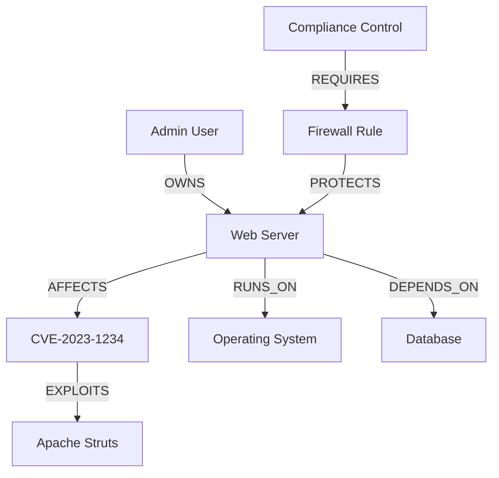

# WINGMAN Data Model

This document outlines the core data model used by WINGMAN to represent security entities and their relationships.

## Core Concepts

### Nodes

Nodes represent entities in the WINGMAN system. Each node has:

- A **label** (e.g., `Asset`, `Vulnerability`, `User`)
- **Properties** (key-value pairs)
- **Relationships** to other nodes

### Relationships

Relationships connect nodes and have:

- A **type** (e.g., `HAS_VULNERABILITY`, `OWNS`)
- **Direction** (start node → end node)
- **Properties** (key-value pairs)

## Node Types

### 1. Asset

Represents any IT asset in your environment.

**Properties:**
- `id`: Unique identifier
- `name`: Display name
- `type`: Server, Workstation, NetworkDevice, etc.
- `ip_address`: IP address(es)
- `os`: Operating system
- `criticality`: High/Medium/Low
- `owner`: Department or team
- `last_seen`: Timestamp

### 2. Vulnerability

Represents a known security vulnerability.

**Properties:**
- `id`: Unique identifier
- `cve_id`: CVE identifier (if applicable)
- `title`: Vulnerability title
- `description`: Detailed description
- `severity`: Critical/High/Medium/Low/Info
- `cvss_score`: CVSS v3.1 base score
- `published_date`: When the vulnerability was published
- `exploit_available`: Boolean
- `remediation`: Recommended fix

### 3. User

Represents a system user or administrator.

**Properties:**
- `id`: Unique identifier
- `username`: Login name
- `email`: Email address
- `department`: Department/team
- `role`: Role in the system
- `last_login`: Timestamp

### 4. Control

Represents a security control or compliance requirement.

**Properties:**
- `id`: Unique identifier
- `name`: Control name
- `description`: Detailed description
- `framework`: NIST, ISO, etc.
- `reference_id`: Framework-specific ID
- `status`: Implemented/Planned/Not Implemented

## Relationship Types

### 1. AFFECTS
- **From**: Vulnerability
- **To**: Asset
- **Properties**:
  - `first_seen`: When the vulnerability was first detected
  - `status`: Open/In Progress/Remediated
  - `proof`: Evidence of the finding

### 2. OWNS
- **From**: User
- **To**: Asset
- **Properties**:
  - `since`: When ownership began
  - `type`: Primary/Secondary/Responsible

### 3. IMPLEMENTS
- **From**: Asset
- **To**: Control
- **Properties**:
  - `implementation_date`: When control was implemented
  - `effectiveness`: High/Medium/Low
  - `evidence`: Link to evidence

### 4. DEPENDS_ON
- **From**: Asset
- **To**: Asset
- **Properties**:
  - `type`: Network/Service/Data
  - `criticality`: High/Medium/Low

## Example Data Model

## Data Model Best Practices

1. **Consistent Naming**
   - Use camelCase for property names
   - Be consistent with terminology
   - Document all custom properties

2. **Data Quality**
   - Enforce required fields
   - Validate data on input
   - Regularly clean up stale data

3. **Performance**
   - Index frequently queried properties
   - Consider data access patterns
   - Archive historical data when appropriate

## Extending the Data Model

WINGMAN allows you to extend the data model to fit your organization's needs:

1. **Custom Node Types**
   - Define new node types as needed
   - Add custom properties
   - Create relationships to existing nodes

2. **Custom Relationships**
   - Define relationship types
   - Add relationship properties
   - Document the meaning and usage

3. **Tags and Labels**
   - Use tags for flexible categorization
   - Apply multiple labels to nodes
   - Create custom indexes for performance

## Next Steps

- [Data Import](../setup/data-import.md)
- [Core Concepts](../core-concepts/graph-database.md)
- [Getting Started](../getting-started/quick-start.md)
