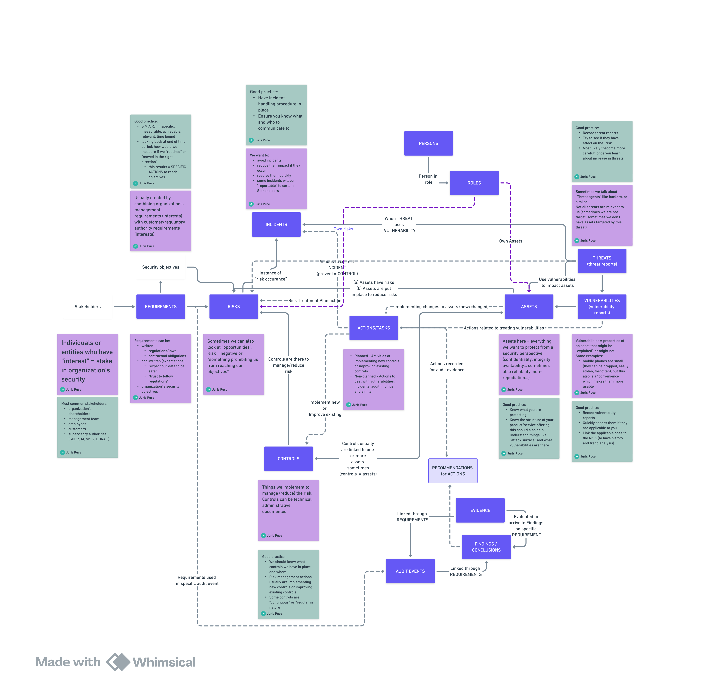

# WINGMAN Data Model

This document outlines the core data model used by WINGMAN to represent security entities and their relationships.

## Core Concepts

### Nodes

Nodes represent entities in the WINGMAN system. Each node has:

- A **label** (e.g., `Asset`, `Vulnerability`, `User`)
- **Properties** (key-value pairs)
- **Relationships** to other nodes
- **Comments** or relationship to a set of comments which are unique for the node and for which user id and timestamp are unique

### Relationships

Relationships connect nodes and have:

- A **type** (e.g., `HAS_VULNERABILITY`, `OWNS`)
- **Direction** (start node → end node)
- **Properties** (key-value pairs)

However user can normally only see the relationship itself and not its type, direction or properties (these are hidden in WINGMAN UI). Some relationships are not shown in the relationships view, but rather are implied (e.g. Ownership of a node) is shown as a node property

## Data Model Best Practices

1. **Consistent Naming**
   - Use camelCase for property names
   - Be consistent with terminology
   - Document all custom properties

2. **Data Quality**
   - Enforce required fields
   - Validate data on input
   - Regularly clean up stale data

3. **Performance**
   - Index frequently queried properties
   - Consider data access patterns
   - Archive historical data when appropriate

## Extending the Data Model

WINGMAN allows you to extend the data model to fit your organization's needs:

1. **Custom Node Types**
   - Define new node types as needed
   - Add custom properties
   - Create relationships to existing nodes

2. **Custom Relationships**
   - Define relationship types
   - Add relationship properties
   - Document the meaning and usage

3. **Tags and Labels**
   - Use tags for flexible categorization
   - Apply multiple labels to nodes
   - Create custom indexes for performance

## Next Steps

- [Data Import](../setup/data-import.md)
- [Core Concepts](../core-concepts/graph-database.md)
- [Getting Started](../getting-started/quick-start.md)
