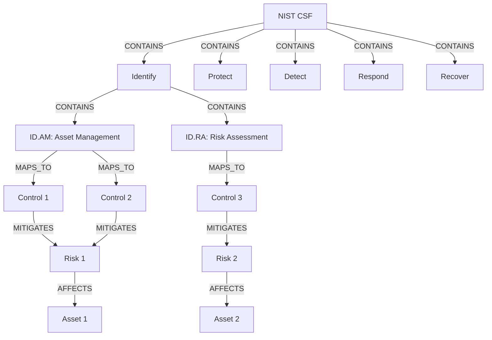

# Understanding the Graph Database Model

WINGMAN leverages the power of graph databases to provide a flexible and powerful way to model complex security relationships. This section explains the fundamentals of graph databases and how they're used in WINGMAN.

## Graph Database Fundamentals

### What is a Graph Database?

A graph database is a type of NoSQL database that uses graph structures for semantic queries with nodes, edges, and properties to represent and store data. Unlike traditional relational databases, graph databases are designed to treat relationships between data as first-class entities.

### Key Components

1. **Nodes**
   - Represent entities or objects (e.g., assets, people, controls)
   - Can have labels to categorize them (e.g., `:Asset`, `:Person`)
   - Contain properties as key-value pairs

2. **Relationships**
   - Connect nodes to each other
   - Are directional and named (e.g., `OWNS`, `MITIGATES`)
   - Can also have properties

3. **Properties**
   - Key-value pairs that store data about nodes and relationships
   - Can be of different data types (string, number, boolean, etc.)

## Why Graph Databases for Security?

### Traditional Database Limitations

Traditional relational databases struggle with:
- Complex, interconnected security data
- Dynamic relationship modeling
- Deep relationship queries
- Evolving schemas

### Graph Database Advantages

1. **Relationship-Centric**
   - Relationships are first-class citizens
   - No need for complex JOIN operations
   - Efficient traversal of deep relationships

2. **Flexible Schema**
   - Add new node types and relationships without schema changes
   - Evolve the data model as needed
   - Support for semi-structured data

3. **Performance**
   - Constant-time relationship traversal
   - Efficient for complex, interconnected queries
   - Scales well with complex relationship patterns

## WINGMAN's Graph Model

### Node Types

WINGMAN defines several node types to model security concepts:

- **Assets**: Things of value that need protection
- **Controls**: Security measures to protect assets
- **Risks**: Potential threats to assets
- **Requirements**: Compliance and regulatory needs
- **Documents**: Policies, procedures, and evidence
- **People**: Users and their roles
- **Findings**: Results of audits and assessments

### Relationship Types

Relationships define how nodes are connected:

- **`OWNS`**: Indicates ownership (e.g., Person → Asset)
- **`MITIGATES`**: Shows risk reduction (e.g., Control → Risk)
- **`AFFECTS`**: Indicates impact (e.g., Risk → Asset)
- **`REQUIRES`**: Shows dependencies (e.g., Control → Requirement)
- **`EVIDENCES`**: Links evidence to controls or requirements
- **`RELATES_TO`**: General relationship between related items

### Properties

Properties provide additional context:

```yaml
# Example Asset Node
{
  "name": "Customer Database",
  "type": "database",
  "owner": "IT Department",
  "confidentiality": "high",
  "availability": "critical",
  "integrity": "high",
  "last_assessed": "2023-11-15"
}
```

## Querying the Graph

WINGMAN uses Cypher, the query language for Neo4j, to interact with the graph database.

### Basic Queries

**Find all assets:**
```cypher
MATCH (a:Asset)
RETURN a
LIMIT 25
```

**Find controls that mitigate a specific risk:**
```cypher
MATCH (r:Risk {name: 'Data Breach'})<-[:MITIGATES]-(c:Control)
RETURN c
```

**Find all assets affected by a vulnerability:**
```cypher
MATCH (v:Vulnerability {cve: 'CVE-2023-1234'})-[:AFFECTS]->(a:Asset)
RETURN a
```

## Visualizing the Graph

WINGMAN provides several visualization tools:

1. **Interactive Graph View**
   - Zoom and pan capabilities
   - Node grouping and filtering
   - Relationship exploration

2. **Table View**
   - Tabular representation of nodes and relationships
   - Sortable and filterable columns
   - Export to CSV/Excel

3. **Dashboard Visualizations**
   - Charts and graphs
   - Heat maps
   - Trend analysis

## Best Practices

### Node Design

- Use specific labels (e.g., `:DatabaseServer` instead of just `:Asset`)
- Keep property names consistent
- Use arrays for multiple values of the same type
- Index frequently queried properties

### Relationship Design

- Use specific, meaningful relationship types
- Add properties to relationships when the relationship itself has attributes
- Consider directionality carefully
- Document relationship semantics

### Performance Considerations

- Use appropriate indexes
- Limit path lengths in queries
- Use `EXPLAIN` to analyze query performance
- Consider using subqueries for complex traversals

## Example: Mapping a Security Control Framework



## Next Steps

- [Learn about Node Types](./node-types.md)
- [Understand Node Relationships](./relationships.md)
- [Explore WINGMAN's Data Model](../setup/data-model.md)
