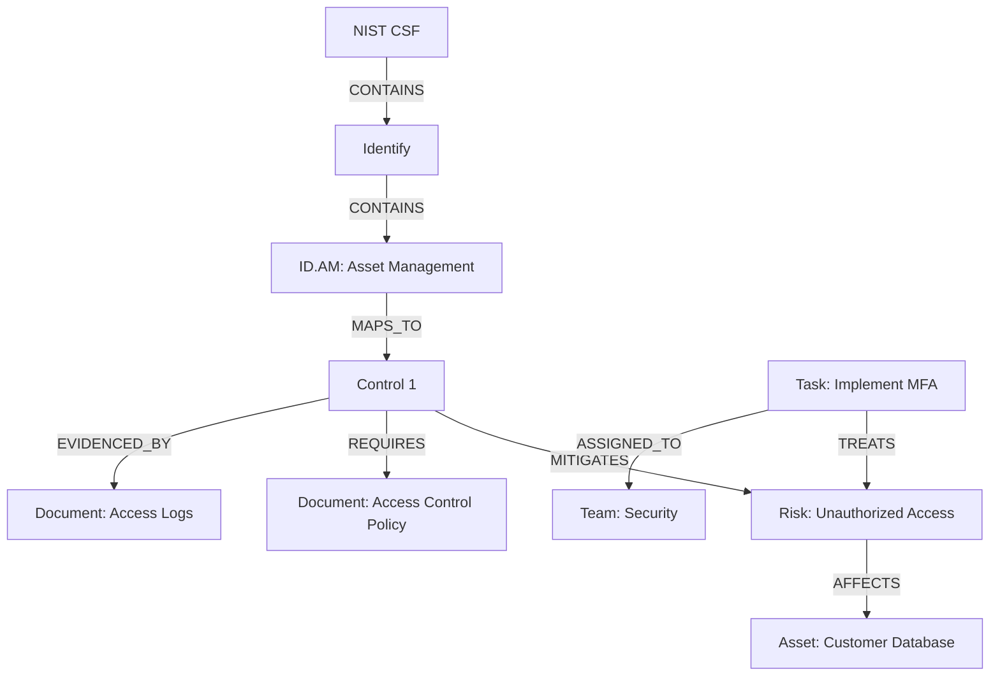

# WINGMAN Node Types

WINGMAN's graph database is composed of various node types that represent different entities in your security ecosystem. Understanding these node types is crucial for effectively using WINGMAN.

## Primary Node Types

### 1. Security Requirements

**Purpose**: Represent compliance requirements, regulatory obligations, and internal security policies.

**Common Properties**:

- `name`: Short name of the requirement
- `description`: Detailed description
- `type`: [policy|regulatory|contractual|organizational]
- `source`: Origin of the requirement (e.g., "GDPR", "NIST 800-53")
- `reference_id`: External reference identifier
- `priority`: [high|medium|low]
- `status`: [draft|active|deprecated]

**Example**:
```yaml
{
  "name": "Password Complexity Requirements",
  "description": "Passwords must be at least 12 characters...",
  "type": "policy",
  "source": "Internal Security Policy",
  "reference_id": "ISP-AC-001",
  "priority": "high",
  "status": "active"
}
```

### 2. Security Controls

**Purpose**: Represent security measures implemented to protect assets and meet requirements.

**Common Properties**:

- `name`: Name of the control
- `description`: Detailed description
- `type`: [preventive|detective|corrective|deterrent|compensating]
- `category`: [technical|administrative|physical]
- `implementation_status`: [planned|implemented|partially_implemented|not_implemented]
- `effectiveness_rating`: [1-5]
- `last_tested`: Date of last test

**Example**:
```yaml
{
  "name": "Multi-Factor Authentication",
  "description": "Requires MFA for all privileged access...",
  "type": "preventive",
  "category": "technical",
  "implementation_status": "implemented",
  "effectiveness_rating": 5,
  "last_tested": "2023-10-15"
}
```

### 3. Documents

**Purpose**: Store and manage security-related documents.

**Types**:
- Policies
- Procedures
- Standards
- Guidelines
- Contracts
- Evidence files

**Common Properties**:

- `title`: Document title
- `type`: Document type
- `version`: Version number
- `status`: [draft|review|approved|archived]
- `owner`: Responsible person/team
- `approval_date`: Date approved
- `review_frequency`: How often to review (e.g., "Annually")

### 4. Risks

**Purpose**: Represent potential threats to the organization.

**Common Properties**:

- `title`: Risk title
- `description`: Detailed description
- `likelihood`: [rare|unlikely|possible|likely|almost_certain]
- `impact`: [negligible|minor|moderate|major|catastrophic]
- `risk_level`: [low|medium|high|extreme] (auto-calculated)
- `status`: [identified|assessed|treated|monitored|closed]
- `treatment_option`: [accept|mitigate|transfer|avoid]

### 5. Assets

**Purpose**: Represent anything of value to the organization.

**Types**:
- Information Assets (data, documents)
- IT Assets (servers, workstations, network devices)
- People (employees, contractors)
- Facilities (buildings, data centers)
- Applications (software, services)

**Common Properties**:

- `name`: Asset name
- `type`: Asset type
- `owner`: Asset owner
- `classification`: [public|internal|confidential|restricted]
- `confidentiality_impact`: [low|medium|high]
- `integrity_impact`: [low|medium|high]
- `availability_impact`: [low|medium|high]

### 6. Tasks/Actions

**Purpose**: Track work items and remediation activities.

**Common Properties**:

- `title`: Task title
- `description`: Detailed description
- `status`: [todo|in_progress|review|done]
- `priority`: [low|medium|high|critical]
- `due_date`: When the task is due
- `assigned_to`: Person/team responsible
- `related_to`: Related node IDs

## Optional Node Types

### 1. Requests for Information (RFIs)

**Purpose**: Track information requests from auditors or other stakeholders.

**Common Properties**:

- `question`: The question being asked
- `status`: [open|pending_response|responded|closed]
- `due_date`: Response deadline
- `assigned_to`: Person/team responsible for responding

### 2. Organization Structure

**Purpose**: Model the organizational hierarchy.

**Types**:
- Departments
- Teams
- Business Units
- Roles

### 3. Service Structure

**Purpose**: Model IT services and their relationships.

**Types**:
- Business Services
- Technical Services
- Service Components
- Dependencies

## Node Relationships

Nodes are connected through various relationship types:

| Relationship | From Node | To Node | Description |
|--------------|-----------|---------|-------------|
| `OWNS` | Person/Team | Asset | Ownership of an asset |
| `RESPONSIBLE_FOR` | Person/Team | Control | Responsibility for a control |
| `MITIGATES` | Control | Risk | Control reduces a risk |
| `TREATS` | Task | Risk | Task addresses a risk |
| `RELATES_TO` | Any | Any | General relationship |
| `EVIDENCES` | Document | Control | Document provides evidence for a control |
| `REQUIRES` | Control | Requirement | Control implements a requirement |
| `AFFECTS` | Risk | Asset | Risk impacts an asset |
| `CONTAINS` | Parent | Child | Hierarchical relationship |
| `DEPENDS_ON` | Node A | Node B | Dependency relationship |

## Custom Node Types

WINGMAN allows creating custom node types to fit your organization's needs:

1. **Define Custom Properties**
   - Add organization-specific fields
   - Create custom dropdowns and validations

2. **Create Custom Relationships**
   - Define relationship semantics
   - Set cardinality rules

3. **Custom Forms**
   - Design input forms for custom types
   - Set required fields and validations

## Best Practices for Node Management

1. **Naming Conventions**
   - Be consistent with naming
   - Use clear, descriptive names
   - Follow organizational standards

2. **Property Usage**
   - Use properties for attributes that have a single value
   - Use relationships for connections to other entities
   - Avoid duplicating information

3. **Data Quality**
   - Keep information up to date
   - Remove or archive obsolete nodes
   - Regularly review and validate data

## Example: Mapping a Control Framework



## Next Steps

- [Understand Node Relationships](./relationships.md)
- [Learn About Graph Database Concepts](./graph-database.md)
- [Explore Data Import Options](../setup/data-import.md)
