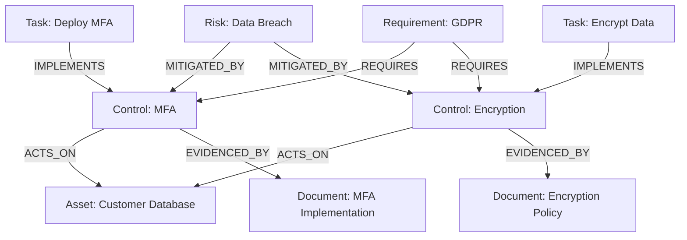

# Node Relationships and Links

In WINGMAN, relationships are the connections between nodes that provide context and meaning to your security data. Understanding how to create, manage, and leverage these relationships is key to getting the most value from the platform.

## Understanding Relationships

### What are Relationships?

Relationships in WINGMAN are directed, named connections between two nodes that can have their own properties. They are the "edges" in the graph database that connect the "nodes."

### Relationship Properties

Relationships can have properties that provide additional context:

- **Strength**: How strong is the relationship (e.g., for risk controls)
- **Date**: When the relationship was established
- **Source**: Where the relationship information came from
- **Confidence**: Certainty about the relationship
- **Notes**: Additional context or comments

## Core Relationship Types

### 1. Structural Relationships

| Relationship | Description | Example |
|--------------|-------------|---------|
| `CONTAINS` | Hierarchical relationship | Department CONTAINS Team |
| `OWNS` | Ownership relationship | Person OWNS Asset |
| `MANAGES` | Management responsibility | Team MANAGES System |
| `REPORTS_TO` | Reporting structure | Employee REPORTS_TO Manager |

### 2. Security Relationships

| Relationship | Description | Example |
|--------------|-------------|---------|
| `MITIGATES` | Control reduces risk | Control MITIGATES Risk |
| `TREATS` | Action addresses risk | Task TREATS Risk |
| `ACTS_ON` | Control applies to asset | Control ACTS_ON Asset |
| `AFFECTS` | Risk impacts asset | Risk AFFECTS Asset |
| `EXPLOITS` | Threat exploits vulnerability | Threat EXPLOITS Vulnerability |

### 3. Compliance Relationships

| Relationship | Description | Example |
|--------------|-------------|---------|
| `IMPLEMENTS` | Control implements requirement | Control IMPLEMENTS Requirement |
| `MAPS_TO` | Mapping between frameworks | NIST_Control MAPS_TO ISO_Control |
| `EVIDENCES` | Document provides evidence | Document EVIDENCES Control |
| `VALIDATES` | Validation of control | Audit VALIDATES Control |

### 4. Process Relationships

| Relationship | Description | Example |
|--------------|-------------|---------|
| `TRIGGERS` | Event starts a process | Event TRIGGERS Process |
| `CREATES` | Process creates artifact | Process CREATES Document |
| `REQUIRES` | Dependency between items | Task REQUIRES Approval |
| `FOLLOWS` | Sequence in a process | Step_B FOLLOWS Step_A |

## Working with Relationships

### Creating Relationships

1. **From the UI**:
   - Navigate to a node
   - Click "Add Relationship"
   - Select the target node and relationship type
   - Add any relationship properties
   - Save

2. **Using the API**:
   ```http
   POST /api/relationships
   {
     "source_id": "node-123",
     "target_id": "node-456",
     "type": "MITIGATES",
     "properties": {
       "strength": "high",
       "notes": "Primary control for this risk"
     }
   }
   ```

### Querying Relationships

**Find all controls that mitigate a specific risk:**
```cypher
MATCH (r:Risk {name: 'Data Breach'})<-[rel:MITIGATES]-(c:Control)
RETURN c, rel.strength as effectiveness
ORDER BY effectiveness DESC
```

**Find all assets affected by a vulnerability with their controls:**
```cypher
MATCH (v:Vulnerability {cve: 'CVE-2023-1234'})-[:AFFECTS]->(a:Asset)<-[:PROTECTS]-(c:Control)
RETURN a.name as asset, collect(DISTINCT c.name) as controls
```

### Visualizing Relationships

WINGMAN provides several ways to visualize relationships:

1. **Graph View**
   - Interactive visualization
   - Filter by relationship type
   - Expand/collapse nodes

2. **Table View**
   - Tabular representation
   - Sort and filter
   - Export capabilities

3. **Path Analysis**
   - Find all paths between nodes
   - Identify critical paths
   - Impact analysis

## Relationship Best Practices

### Naming Conventions

- Use UPPER_SNAKE_CASE for relationship types
- Be specific (e.g., `OWNS` vs `HAS`)
- Consider directionality (e.g., `OWNS` vs `OWNED_BY`)

### When to Create Relationships

- When there's a meaningful connection between entities
- When the relationship has properties of its own
- When you need to query or visualize the connection

### Common Pitfalls

1. **Over-linking**
   - Don't create relationships "just in case"
   - Each relationship should have a clear purpose

2. **Under-linking**
   - Important connections should be explicitly modeled
   - Don't rely on inference when direct relationships would be clearer

3. **Circular References**
   - Be cautious of circular paths that could cause infinite loops
   - Use properties like `valid_from` and `valid_to` for time-bound relationships

## Advanced Relationship Patterns

### Temporal Relationships

For time-sensitive relationships, add temporal properties:

```cypher
CREATE (p:Person)-[r:WORKS_IN {
  valid_from: date('2020-01-01'),
  valid_to: date('2023-12-31'),
  role: 'Security Analyst'
}]->(d:Department)
```

### Weighted Relationships

Add weights to indicate relationship strength:

```cypher
MATCH (c:Control)-[r:MITIGATES]->(r:Risk)
SET r.strength = 0.8
```

### Relationship Hierarchies

Model relationship hierarchies for complex scenarios:

```
(Control)-[:HAS_PART]->(Subcontrol)-[:HAS_PART]->(Procedure)
```

## Example: Risk Management Workflow



## Next Steps

- [Learn About Graph Database Concepts](./graph-database.md)
- [Explore Node Types](./node-types.md)
- [Discover Advanced Querying Techniques](../usage/advanced-queries.md)
