# Suggestions: Enabling Human-in-the-Loop Decision Making

The concept of suggestions in WINGMAN covers the AI driven suggestions for changes to the Security relevant data in the organization. As the name "suggests", the suggestions are areas of improvement WINGMAN AI considers necessary, but they need "Human in the loop" approvals before getting approved.

## The Art of Intelligent Recommendations

In the world of security management, the difference between effective AI assistance and digital noise often comes down to one critical factor: knowing when to ask for human judgment. WINGMAN's suggestion system embodies this philosophy, serving as the bridge between AI insights and human expertise.

Rather than making autonomous decisions that might overlook crucial context, WINGMAN generates intelligent suggestions that present options, highlight implications, and empower security professionals to make informed choices.

## What Are Suggestions in WINGMAN?

Suggestions are AI-generated recommendations that emerge from WINGMAN's analysis of your security context. They represent actionable insights derived from the relationships between nodes in your security graph, triggered by events, changes, or scheduled reviews within your defined Flows.

Think of suggestions as your AI colleague tapping you on the shoulder and saying, "Based on what I'm seeing, you might want to consider this..." followed by well-reasoned recommendations backed by actual data from your environment.

### Key Characteristics of WINGMAN Suggestions

- **Context-Aware**: Generated based on your organization's specific security posture and current state
- **Relationship-Driven**: Leverage the graph database to identify non-obvious connections and impacts
- **Actionable**: Each suggestion includes clear next steps and rationale
- **Prioritized**: Ranked by potential impact and urgency based on your security context
- **Traceable**: Full audit trail of suggestion generation, human decisions, and outcomes

## How AI Flows Generate Suggestions

WINGMAN's AI flows continuously analyze your security graph, looking for patterns, anomalies, and opportunities for improvement. When specific conditions are met, flows generate suggestions that appear in your dashboard for human review.

### Flow Trigger Examples

**Event-Driven Triggers**
   - New vulnerability discovered affecting critical assets
   - Security control failing effectiveness metrics
   - Compliance deadline approaching without assigned owner
   - Risk rating changes based on threat intelligence updates

**Pattern Recognition Triggers**
   - Multiple assets sharing common vulnerabilities
   - Controls protecting similar asset types showing degraded performance
   - Recurring incident patterns suggesting systemic issues
   - Resource allocation imbalances across security domains

**Proactive Analysis Triggers**
   - Scheduled security posture reviews
   - Compliance gap analysis
   - Risk assessment refreshes
   - Control effectiveness evaluations

## Types of Suggestions

WINGMAN suggestions focus on three core operations within the security graph: updating node metadata, managing relationships between nodes, and creating or updating nodes themselves. Each suggestion type addresses specific aspects of maintaining an accurate, up-to-date security context.

### 1. **Node Metadata Update Suggestions**

These suggestions improve the quality and accuracy of information stored within individual nodes, ensuring descriptions, risk assessments, and other metadata remain current and useful.

#### **Risk Description Enhancement**

**Scenario**: AI detects that a risk description lacks detail about recent threat intelligence updates.

**Suggestion Generated**:
```
📝 METADATA UPDATE SUGGESTION
Title: Risk Description Requires Threat Intelligence Context
Type: Node Metadata Update
Target Node: RISK-2024-003 "Unpatched Web Server Vulnerabilities"

Current Description: "Web servers may have unpatched vulnerabilities that could be exploited"

AI Analysis:
• Recent threat intelligence indicates CVE-2024-1234 is actively exploited
• Current description doesn't reflect severity or specific threat context
• Similar risks in other organizations now include exploitation likelihood

Suggested Actions:
NODE UPDATE: Update risk description with specific details:

Proposed New Description:
"Web servers contain CVE-2024-1234 vulnerability with confirmed active exploitation 
in the wild. Threat actors using automated scanning tools to identify vulnerable 
instances. Exploitation leads to remote code execution with potential for data 
exfiltration. Current likelihood: HIGH (active exploitation detected). 
Impact assessment updated based on ThreatIntel-Feed-001 analysis."

Additional Metadata Updates:
• Risk likelihood: Medium → High
• Last reviewed: Update to current date
• Threat intelligence sources: Add reference to ThreatIntel-Feed-001
```

#### **Asset Description Improvement**

**Scenario**: AI identifies an asset with insufficient contextual information for effective security management.

**Suggestion Generated**:
```
📝 METADATA UPDATE SUGGESTION
Title: Critical Asset Missing Security Context
Type: Node Metadata Update
Target Node: ASSET-WEB-001 "Production Web Server"

Current Description: "Web server hosting company website"

AI Analysis:
• Asset handles sensitive customer data (discovered via data flow analysis)
• Missing criticality classification and compliance scope
• Insufficient detail for effective risk assessment

Suggested Actions:
NODE UPDATE: Enhance asset description with security context:

Proposed New Description:
"Production web server hosting customer-facing e-commerce platform. Processes 
payment transactions (PCI DSS scope). Stores customer personal data including 
names, addresses, payment methods (GDPR scope). Handles 10,000+ daily 
transactions. Critical for business operations - downtime impacts revenue 
at $50,000/hour. Located in DMZ, accessible from internet."

Additional Metadata Updates:
• Asset criticality: Unknown → Critical
• Compliance scope: Add "PCI DSS, GDPR"
• Data classification: Add "Payment data, Personal data"
• Business impact: Add "Revenue critical"
```

### 2. **Node Relationship Update Suggestions**

These suggestions create or modify connections between nodes to accurately reflect security relationships and dependencies within the organization.

#### **Risk-to-Asset Relationship Creation**

**Scenario**: AI discovers that a risk affects multiple assets that aren't currently linked in the security graph.

**Suggestion Generated**:
```
🔗 RELATIONSHIP UPDATE SUGGESTION
Title: Risk Impact Missing Critical Asset Connections
Type: Node Relationship Update
Source Node: RISK-2024-005 "Insider Threat to Financial Systems"

AI Analysis:
• Risk currently linked to 2 assets but analysis shows 7 additional affected assets
• Missing relationships may lead to incomplete risk treatment
• Similar insider threat scenarios typically affect broader asset scope

Suggested Actions:
CREATE RELATIONSHIPS: Add "AFFECTS" relationships:

New Relationships to Create:
1. RISK-2024-005 → [AFFECTS] → ASSET-DB-003 "Customer Database"
2. RISK-2024-005 → [AFFECTS] → ASSET-APP-007 "Financial Reporting System"
3. RISK-2024-005 → [AFFECTS] → ASSET-NET-002 "Internal Network Shares"
4. RISK-2024-005 → [AFFECTS] → ASSET-SRV-012 "Backup Server"
5. RISK-2024-005 → [AFFECTS] → ASSET-APP-015 "HR Management System"

Rationale for Each Relationship:
• Customer Database: Contains financial transaction history accessible to insiders
• Financial Reporting: Direct access by finance team members
• Network Shares: Contains sensitive financial documents
• Backup Server: Historical data accessible to privileged users
• HR System: Payroll and compensation data attractive to insider threats

Impact: More comprehensive risk assessment and treatment planning
```

#### **Task-to-Control Relationship Creation**

**Scenario**: AI identifies tasks that should be linked to specific controls for better tracking of control implementation and maintenance.

**Suggestion Generated**:
```
🔗 RELATIONSHIP UPDATE SUGGESTION
Title: Implementation Tasks Missing Control Linkage
Type: Node Relationship Update
Target Nodes: Multiple tasks and controls requiring linkage

AI Analysis:
• 8 active tasks appear to implement or maintain security controls
• Missing "IMPLEMENTS" and "MAINTAINS" relationships
• Difficult to track control effectiveness without task linkage

Suggested Actions:
CREATE RELATIONSHIPS: Link tasks to relevant controls:

Task-to-Control Relationships:
1. TASK-2024-045 "Deploy MFA for Admin Accounts" 
   → [IMPLEMENTS] → CONTROL-IAM-003 "Multi-Factor Authentication"

2. TASK-2024-046 "Quarterly Access Review" 
   → [MAINTAINS] → CONTROL-IAM-001 "Access Control Management"

3. TASK-2024-047 "Update Firewall Rules" 
   → [MAINTAINS] → CONTROL-NET-002 "Network Segmentation"

4. TASK-2024-048 "Security Awareness Training Q1" 
   → [IMPLEMENTS] → CONTROL-GOV-005 "Security Education Program"

Benefits:
• Improved control implementation tracking
• Better visibility into control maintenance activities
• Enhanced compliance reporting capabilities
• Clear accountability for control effectiveness
```

### 3. **Node Creation/Update Suggestions**

These suggestions create new nodes (typically tasks) or update existing nodes to address identified security gaps or improvement opportunities.

#### **Task Creation for Risk Treatment**

**Scenario**: AI identifies a high-risk scenario without adequate treatment tasks.

**Suggestion Generated**:
```
➕ NODE CREATION SUGGESTION
Title: High-Risk Scenario Requires Treatment Tasks
Type: Node Creation
Context: RISK-2024-007 "Database Breach via SQL Injection"

AI Analysis:
• Risk rating: 8.5/10 (High)
• Current treatment: No active tasks identified
• Similar risks in industry require multi-layered approach
• Regulatory requirements mandate specific controls

Suggested Actions:
CREATE NEW TASKS: Comprehensive risk treatment approach:

New Task 1: TASK-2024-055
Title: "Implement Database Input Validation"
Description: "Deploy comprehensive input validation and parameterized queries 
            across all database-connected applications"
Priority: High
Assigned to: Development Team Lead
Due date: 30 days
Effort estimate: 40 hours
Relationships to create:
• TASK-2024-055 → [TREATS] → RISK-2024-007
• TASK-2024-055 → [IMPLEMENTS] → CONTROL-APP-003 "Secure Coding Practices"

New Task 2: TASK-2024-056
Title: "Deploy Database Activity Monitoring"
Description: "Install and configure database activity monitoring solution 
            with real-time SQL injection detection"
Priority: High
Assigned to: Database Administrator
Due date: 21 days
Effort estimate: 16 hours
Relationships to create:
• TASK-2024-056 → [TREATS] → RISK-2024-007
• TASK-2024-056 → [IMPLEMENTS] → CONTROL-MON-004 "Database Monitoring"

New Task 3: TASK-2024-057
Title: "Conduct SQL Injection Penetration Test"
Description: "Engage external security firm to validate SQL injection defenses"
Priority: Medium
Assigned to: Security Manager
Due date: 45 days
Effort estimate: 8 hours (coordination)
Relationships to create:
• TASK-2024-057 → [VALIDATES] → RISK-2024-007
```

#### **Control Enhancement Through Task Creation**

**Scenario**: AI determines that an existing control needs improvement based on effectiveness metrics or industry best practices.

**Suggestion Generated**:
```
➕ NODE CREATION SUGGESTION
Title: Underperforming Control Requires Enhancement
Type: Node Creation
Context: CONTROL-MON-001 "Security Event Monitoring"

AI Analysis:
• Control effectiveness score: 6.2/10 (Below target of 8.0)
• Recent incidents bypassed current monitoring capabilities
• Industry benchmarks suggest additional detection rules needed
• SIEM utilization at 45% of recommended rule coverage

Current Control Status:
• Last updated: 6 months ago
• Detection rules: 127 (recommended: 280)
• False positive rate: 15% (target: <5%)
• Mean time to detection: 4.2 hours (target: <1 hour)

Suggested Actions:
CREATE NEW TASKS: Control improvement initiative:

New Task 1: TASK-2024-058
Title: "Expand SIEM Detection Rule Coverage"
Description: "Implement additional 150+ detection rules covering MITRE ATT&CK 
            framework gaps, focusing on tactics with zero current coverage"
Priority: High
Assigned to: SOC Team Lead
Due date: 60 days
Effort estimate: 80 hours
Relationships to create:
• TASK-2024-058 → [IMPROVES] → CONTROL-MON-001

New Task 2: TASK-2024-059
Title: "Optimize SIEM Alert Tuning"
Description: "Reduce false positive rate through alert threshold optimization 
            and correlation rule refinement"
Priority: Medium
Assigned to: Security Analyst
Due date: 45 days
Effort estimate: 32 hours
Relationships to create:
• TASK-2024-059 → [IMPROVES] → CONTROL-MON-001

Expected Outcomes:
• Control effectiveness score: 6.2 → 8.5
• Detection coverage: 45% → 85%
• False positive rate: 15% → 4%
• Mean time to detection: 4.2 hours → 45 minutes
```

## Human Decision-Making Process

### Suggestion Review Workflow

**Initial Review** (30 seconds)
   - Read AI context and analysis
   - Assess immediate threat level
   - Determine if suggestion aligns with current priorities

**Detailed Analysis** (2-5 minutes)
   - Review supporting data and relationships
   - Consider organizational context not captured by AI
   - Evaluate resource availability and competing priorities

**Decision Making** (1-2 minutes)
   - Accept, modify, reject, or defer the suggestion
   - Provide reasoning for decision (captured for AI learning)
   - Set implementation timeline if accepted

**Implementation Tracking**
   - Monitor progress on accepted suggestions
   - Provide feedback on suggestion quality and outcomes
   - Update AI models based on results

### Decision Context Examples

**Accepting a Suggestion**:
```
✅ ACCEPTED: Critical Vulnerability Mitigation
Reason: "Threat intelligence confirms active exploitation. 
        Customer data at risk justifies immediate action."
Timeline: 24 hours for patches, 48 hours for testing
Assigned: Security Operations Team
```

**Modifying a Suggestion**:
```
⚠️ ACCEPTED WITH MODIFICATIONS: Control Review Schedule
Original: Review all 7 controls within 2 weeks
Modified: Prioritize 3 SOC 2 critical controls this week, 
         remaining 4 controls over next month
Reason: "Limited team availability due to ongoing incident response.
        Focusing on audit-critical items first."
```

**Rejecting a Suggestion**:
```
❌ REJECTED: Additional Email Security Investment
Reason: "Recently implemented competing solution with similar capabilities.
        AI analysis didn't account for new deployment."
Learning Note: Update context with recent security tool implementations
```

**Deferring a Suggestion**:
```
🕐 DEFERRED: Resource Rebalancing
Reason: "Valid analysis, but currently managing major security project.
        Will revisit after project completion in 3 weeks."
Review Date: Set for automatic re-evaluation
```

## Suggestion Quality and Continuous Improvement

### AI Learning from Human Decisions

WINGMAN continuously improves suggestion quality by learning from human decisions:

- **Acceptance Patterns**: Understanding which types of suggestions provide value
- **Modification Trends**: Learning when AI recommendations need human refinement
- **Rejection Reasons**: Identifying gaps in AI context or analysis
- **Outcome Tracking**: Measuring effectiveness of implemented suggestions

### Feedback Mechanisms

**Quick Feedback** (one-click):
- 👍 "This suggestion was helpful"
- 👎 "This suggestion wasn't relevant"
- 🎯 "This suggestion was accurate but poorly timed"

**Detailed Feedback** (optional):
- Context the AI missed
- Additional factors to consider
- Suggestions for improvement

### Suggestion Metrics Dashboard

Track suggestion program effectiveness:
- **Acceptance Rate**: Percentage of suggestions accepted (target: 70-80%)
- **Implementation Success**: Accepted suggestions successfully completed
- **Time to Decision**: How quickly humans can evaluate suggestions
- **Outcome Quality**: Effectiveness of implemented suggestions

## Best Practices for Human-in-the-Loop Suggestions

### For Security Teams

**Regular Review Cadence**
   - Check suggestions dashboard daily
   - Batch process similar suggestion types
   - Set aside focused time for suggestion review

**Decision Documentation**
   - Always provide reasoning for decisions
   - Include context that AI might miss
   - Document lessons learned from outcomes

**Collaborative Review**
   - Involve relevant stakeholders in complex decisions
   - Share suggestion rationale with team members
   - Use suggestions as discussion starters in team meetings

### For Organizations

**Suggestion Governance**
   - Define approval thresholds for different suggestion types
   - Establish escalation procedures for high-impact suggestions
   - Regular review of suggestion quality and relevance

**Integration with Existing Processes**
   - Align suggestions with change management procedures
   - Integrate with existing task and project management systems
   - Ensure suggestions complement rather than conflict with planned activities

**Continuous Improvement**
   - Regular feedback sessions with AI system
   - Quarterly review of suggestion effectiveness
   - Adjustment of AI parameters based on organizational learning

## The Human Element: Why Suggestions Matter

WINGMAN's suggestion system recognizes a fundamental truth about security management: the most sophisticated AI analysis is only as valuable as the human judgment that guides its implementation. Suggestions provide the perfect balance between AI efficiency and human wisdom.

They ensure that:

- **Context is considered**: Humans can factor in organizational politics, resource constraints, and strategic priorities
- **Nuance is preserved**: Complex security decisions often require understanding subtleties that AI might miss
- **Accountability is maintained**: Human decision-makers remain responsible for security outcomes
- **Learning occurs**: Both AI and human expertise improve through the collaborative process

In essence, suggestions transform WINGMAN from a mere recommendation engine into a true collaborative partner in security management—one that amplifies human expertise rather than attempting to replace it.

---

## Key suggestion points

```mermaid
flowchart LR
    A[Suggestion Generated] --> B{Review Suggestion}
    
    B --> C[✅ Accept]
    B --> D[⚠️ Modify] 
    B --> E[❌ Reject]
    B --> F[🕐 Defer]
    
    C --> G[Immediate Implementation]
    D --> H[Adjust & Implement]
    E --> I[Learn from Rejection]
    F --> J[Future Review]
    
    G --> K[Track Success]
    H --> K
    I --> L[Improve AI]
    J --> M[Re-evaluate Later]
    
    K --> L
    M --> B
    
    %% Styling
    classDef accept fill:#c8e6c9
    classDef modify fill:#fff9c4
    classDef reject fill:#ffcdd2
    classDef defer fill:#e1bee7
    
    class C,G accept
    class D,H modify
    class E,I reject
    class F,J,M defer
```



## Suggestion type outcomes

Diagram based on several examples (not extensive)


*The suggestion system represents the core of WINGMAN's human-in-the-loop philosophy: intelligent analysis paired with human judgment for optimal security outcomes.*