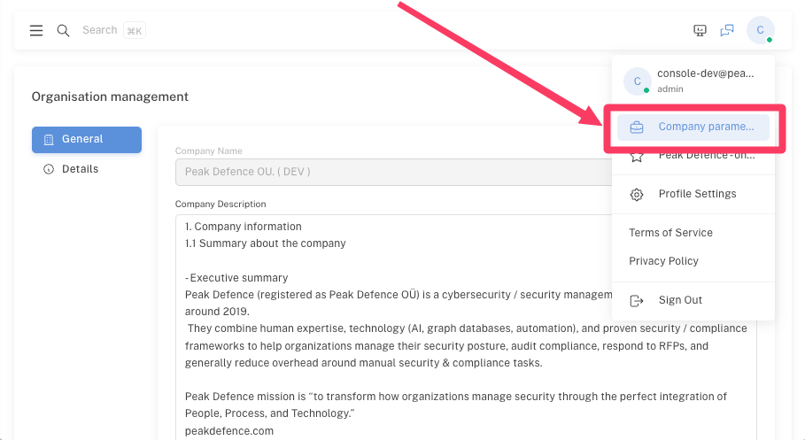
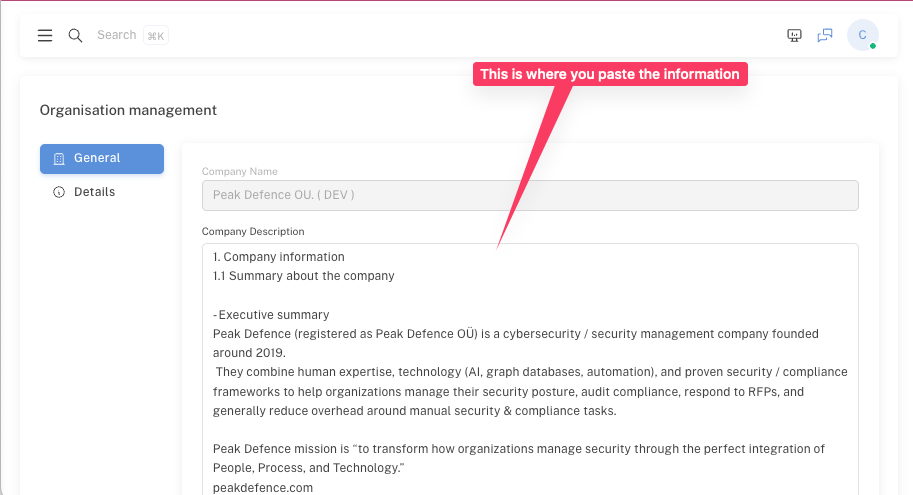

# Phase 1: Creating Your Company Context

*Or: Teaching an AI About Your Organization Without Accidentally Admitting You Don't Know What Your Organization Actually Does*

---

## The Uncomfortable Reality Check 🎯

Here's something your consultants won't tell you: most executives can't actually explain what their company does in under five minutes without resorting to buzzwords that would make a LinkedIn influencer blush. "We leverage synergies to drive stakeholder value through digital transformation" is not a business description—it's corporate Mad Libs gone horribly wrong.

WINGMAN needs to understand your actual business, not the fiction you've been peddling to investors. Think of this as therapy for your organization, except the therapist is an AI and the couch is a markdown file.

---

## Why Context Matters (Or: Why Generic Security is Like Generic Medicine)

You wouldn't take random pills from a stranger's medicine cabinet just because they're also human, would you? (If you would, we have bigger problems to discuss.) Yet that's exactly what organizations do with security templates—grab whatever looks official and hope for the best.

WINGMAN's context-driven approach means it understands that:
- Your "cloud infrastructure" might just be Bob's laptop running hot in the server closet
- Your "global supply chain" could be ordering paper clips from Amazon
- Your "AI-powered solution" is probably just a spreadsheet with conditional formatting

The more honest you are about your actual operations, the better WINGMAN can help you. Revolutionary concept, I know.

---

## The Quick Win Box 🏆

**What You'll Actually Achieve:**
- A coherent description of your business (possibly for the first time)
- WINGMAN understanding your specific risks (not generic "cyber bad, security good")
- The foundation for every other security decision you'll make
- A document you can actually show to auditors without sweating through your shirt

**Time Required:** 2-4 hours (or 30 minutes if you're delusional about your self-awareness)

---

## Step-by-Step Guide: Building Your Context

### Step 1: The Brutal Self-Assessment

Before you touch a keyboard, answer these questions honestly (lying to yourself is free, but expensive later):

1. **What do you actually sell?** 
   - Not "solutions" or "excellence"—actual things people pay money for
   - If you can't explain it to a reasonably intelligent 12-year-old, you don't understand it

2. **Who are your real customers?**
   - "Everyone" is not a market segment
   - "Enterprises" means you're probably selling to Barry in Procurement

3. **What data actually matters?**
   - Customer credit cards? Medical records? That spreadsheet where Dave tracks who owes for coffee?
   - If it got leaked, what would actually hurt?

4. **How do you really operate?**
   - Remote work = "everyone's home WiFi is now our attack surface"
   - Global offices = "we have no idea what the Singapore team is doing"
   - Agile methodology = "we change everything constantly and document nothing"

### Step 2: The Context Document Structure

Here's the template that actually works (stolen—sorry, "adapted"—from organizations that survived their audits):

```markdown
# [Company Name] Context Document

## Executive Summary
[Two sentences max. If you need more, you don't understand your business.]

## What We Do
### Core Business
[What you actually do, not what your marketing team claims]

### Products/Services
- Product A: [What it is, who uses it, why they care]
- Service B: [Same structure, less buzzwords]

## How We Operate
### Business Model
[How money flows in and out, simplified for normal humans]

### Organizational Structure
[Who does what, without the org chart fiction]

### Technology Stack
[What you actually use, not what you bought licenses for]

## Critical Information Assets
### What We Protect
- Customer Data: [Specifically what, not "everything"]
- Intellectual Property: [That one algorithm, not "our innovative culture"]
- Operational Data: [The stuff that keeps the lights on]

### Where It Lives
[Actual systems, not "the cloud" unless you specify which cloud]

## Regulatory Landscape
[Laws you actually need to follow, not every regulation you've heard of]

## Key Risks We Face
[Real concerns, not "hackers" and "acts of God"]
```

### Step 3: The Writing Process (With Minimal Tears)

If you are not happy with whatever is being proposed to you in the template, one of the options is to generate the template with the help of AI or AI-based web search tools. You can do this in your favorite LLM like ChatGPT or Claude as well as in tools like Perplexity. Here's a small sample video below.

<iframe width="640" height="480" src="https://www.youtube.com/embed/3QP2vBjTl5I" title="YouTube video player" frameborder="0" allow="accelerometer; autoplay; clipboard-write; encrypted-media; gyroscope; picture-in-picture" allowfullscreen></iframe>

Once you edit these outputs or write your own descriptions from scratch: here is a short guide to follow:

**The Opening Gambit:**
Start with what you tell people at parties when they ask what you do. If their eyes glaze over, try again. Keep trying until your spouse could explain it after three wines.

**The Details That Matter:**
- **Products/Services:** Write like you're explaining to a new employee, not impressing a VC
- **Technology:** List what you use daily, not what's gathering digital dust
- **Customers:** Describe actual humans/organizations, not personas from marketing

**The Reality Check:**
For each claim you make, ask:
- Is this actually true or just aspirational?
- Would an employee laugh if they read this?
- Could an auditor verify this without crying?

### Step 4: The WINGMAN Upload Moment of Truth

Navigate to your WINGMAN instance and upload your context document.

Step 1: selecting "Company Parameters"



Step 2: Fill in the data with the output (edit it)


Watch as the AI either:

- Understands your business better than your board of directors
- Gently suggests that "leveraging blockchain for synergistic disruption" isn't actually a business model (*well ok - we don't have this feature yet in production*)


---

## Real Example (That Won't Get Anyone Fired)

Want to see how the "professionals do it"? Check out this [sample context document](../setup/company-context-example.md) from an organization that actually survived the process - us (however as you can see even we haven't filled in all sections at this stage yet).

Notice how we:
- Try to use actual words instead of consultant-speak
- Admit they use Google Workspace instead of claiming "enterprise-grade collaborative infrastructure"

---

## Common Pitfalls (Learn From Others' Pain)

### The Buzzword Bingo Trap
❌ "We're a digital-first, AI-native, blockchain-enabled solutions provider"
✅ "We sell software that helps accountants file taxes faster"

### The Everything is Critical Fallacy
❌ "All our data is mission-critical and requires maximum security"
✅ "Customer payment data and our source code are critical. The lunch menu is not."

### The Fictional Capability Syndrome
❌ "Our SOC operates 24/7/365"
✅ "Steve checks the security alerts when he remembers, usually on Tuesdays"

---

## What WINGMAN Can Now Do 🚀

With proper context, WINGMAN can:

- Generate relevant risk scenarios (not generic "ransomware bad")
- Generate documents based on combination of our templates and your context. Much better than out of the box LLM chatbot stuff
- Suggest appropriate controls (matching your actual capabilities)
- Create policies that reflect reality (shocking, I know)
- Ask intelligent questions about your security posture (prepare to feel judged)

Without proper context, WINGMAN will:

- Generate generic advice suitable for any organization from a Fortune 500 to your nephew's Minecraft server
- Suggest controls you can't possibly implement
- Create policies that will gather dust faster than exercise equipment in February

---

## Validation Checklist ✅

Before moving to Phase 2, ensure:

- [ ] You can explain your business in one paragraph without using the word "synergy"
- [ ] Your technology stack description matches what's actually installed
- [ ] An employee reading this would nod, not laugh
- [ ] You've been honest about your actual capabilities

---

## Next Steps

**Ready to proceed?** 
Your context document should now exist in that sweet spot between "brutal honesty" and "not getting fired for being too honest."

[**Continue to Phase 2: Documentation & Knowledge Base →**](2nd-step.md)

**Need help?**
[**Context Template Download →**](/setup/context-template.md)
[**Book a call with us →**](https://app.usemotion.com/meet/juris-puce/meeting?d=30)


---

## Pro Tips From the Trenches 💡

1. **Write drunk, edit sober** - Not literally (HR wouldn't approve), but write your first draft without self-censoring, then edit for political palatability

2. **The Nephew Test** - If your nephew who "does computers" wouldn't understand your technical description, neither will WINGMAN

3. **The Time Travel Test** - Write as if you're explaining to yourself from six months ago, when you still had hope and believed in project timelines

4. **Version Control** - Save versions. You'll thank yourself when someone asks why you wrote "our security is held together by prayer and Steve's vigilance"

---

*Remember: The goal isn't to impress WINGMAN with your organization's complexity. It's to help WINGMAN understand your organization's reality. There's a difference, and it's about £50,000 in consultant fees.*

---

**Last Updated:** [Today's date]
**Estimated Completion Time:** 2-4 hours (1 hour if you're lying to yourself)
**Survival Rate:** 94% (6% gave up and hired consultants)