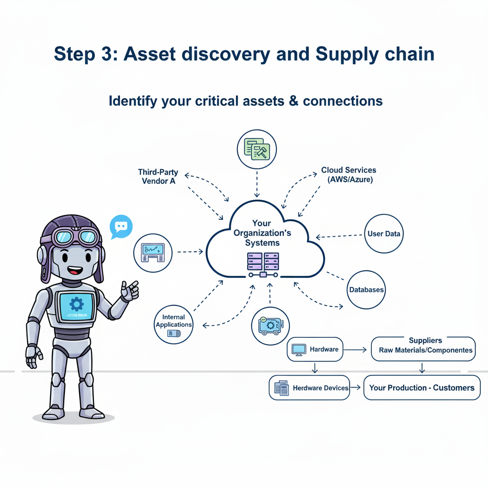
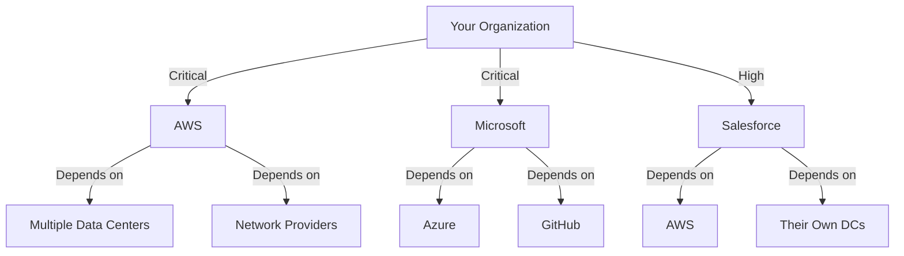

# Phase 3: Asset Discovery & Mapping (Day 6-8)
## "Finding All The Things You Forgot You Had (And The Vendors You Wish You Could Forget)"

### Why This Part Is Important



Remember when you thought you had "about 50 systems" and it turned out to be 247? Or when Dave from accounting casually mentioned that "small database" that turned out to contain every customer's financial records since 1987? Welcome to Asset Discovery - where optimistic estimates go to die.

Here's the brutal truth: You can't protect what you don't know exists. And in most organizations, what you don't know exists could fill a data center (and probably does, somewhere in AWS region you forgot about). WINGMAN needs to understand not just what you have, but how it all connects, who supplies it, and why that vendor from 2015 still has production access.

This phase isn't just about making lists. It's about understanding the terrifying web of dependencies that keeps your organization running. It's about discovering that your critical payment processing system relies on Bob's Excel macro, which connects to a database in Finland, managed by a company that was acquired three times since you signed the contract.

### What You'll Achieve

**Time Required:** 3 days (if you're organized), 5 days (reality), 2 weeks (if you include crying time)

By the end of this phase, you'll have:

- A complete **asset inventory**
- **Supply chain** visibility 
- **Information structure** in the assets
- A clear picture of what's stored where (focusing on sensitive and personal data)
- A starting step to ensure the **access controls** are implemented correctly


---

## The Asset Reality Check

### What Nobody Tells You About Asset Management

Before we dive in, let's address the elephant in the server room: traditional asset management is broken. Most organizations have:

1. **The IT Asset List** - Servers, laptops, and lies
2. **The Finance Asset List** - Anything that cost money (except SaaS, somehow)
3. **The Security Asset List** - Critical systems (defined differently by everyone)
4. **The Actual Assets** - 3x more than all lists combined

WINGMAN approaches this differently. Instead of starting with technology (boring) or spreadsheets (soul-crushing), we start with what actually matters: **What does your organization do, and what makes that possible?**

### The Four Perspectives of Asset Discovery

| Perspective | What It Reveals | Why It Matters | Typical Surprises |
|---|---|---|---|
| **Product/Service View** | Assets that directly support what you sell | These are crown jewels - lose them, lose revenue | "Wait, our main product depends on THAT?" |
| **Business Process View** | Assets that enable operations | These keep the lights on | "HR uses HOW many systems?" |
| **Technical Infrastructure View** | The traditional IT perspective | The foundation everything sits on | "Who's paying for these 47 AWS accounts?" |
| **Data/Information View** | Where information lives and flows | GDPR's favorite hunting ground | "Customer data is WHERE now?" |

---

## Core Implementation Sections

### Asset Management Setup

#### Step-by-Step Guide

**Starting Perspective: Choose Your Fighter**

Most organizations fail at asset discovery because they start with IT infrastructure. That's like trying to understand a city by cataloging its sewers. Important? Yes. Inspiring? No. Comprehensive? Never.

**Option 1: Product/Service-Based Discovery (Recommended)**

1. **List Your Products/Services** (30 minutes)
   ```yaml
   Example for FinTech Company:
     Products:
       - Mobile Banking App
       - Payment Processing API
       - Fraud Detection Service
       - Customer Analytics Dashboard
   ```

2. **Map Supporting Assets per Product** (2 hours)
   ```yaml
   Mobile Banking App:
     Frontend:
       - iOS App (Swift, hosted on App Store)
       - Android App (Kotlin, hosted on Play Store)
       - Web Portal (React, hosted on AWS CloudFront)
     Backend:
       - API Gateway (Kong, AWS ECS)
       - Authentication Service (Auth0)
       - Core Banking API (Java, AWS EKS)
     Data Stores:
       - Customer Database (PostgreSQL RDS)
       - Transaction History (MongoDB Atlas)
       - Session Cache (Redis ElastiCache)
     Third-Party Services:
       - SMS Gateway (Twilio)
       - Push Notifications (Firebase)
       - Analytics (Mixpanel)
   ```

3. **Identify Cross-Product Dependencies** (1 hour of revelation)
   - Shared authentication service (single point of failure found!)
   - Common database (GDPR nightmare identified!)
   - Central API gateway (bottleneck discovered!)

**Option 2: Business Process View (For Non-Tech Companies)**

1. **Map Core Business Processes** (1 hour)
   ```yaml
   Core Processes:
     - Customer Onboarding
     - Order Fulfillment  
     - Invoice & Payment
     - Customer Support
     - Employee Management
   ```

2. **Identify Process-Supporting Assets** (2-3 hours)
   ```yaml
   Customer Onboarding:
     Systems:
       - CRM (Salesforce)
       - Document Management (SharePoint)
       - E-signature (DocuSign)
       - Email Platform (Office 365)
     Data:
       - Customer Applications
       - KYC Documents
       - Contract Templates
     Suppliers:
       - Background Check Service (Checkr)
       - Credit Check Service (Experian)
   ```

### Asset Discovery Methods

#### The Multi-Pronged Approach (Because One Method Never Works)

**1. Automated Discovery (The Technical Truth)**

```bash
# Network Scanning (with IT's permission, unless you enjoy unemployment)
WINGMAN Discovery Agents:
  - Network Scanner: Finds devices on network
  - Cloud Discovery: AWS, Azure, GCP inventory
  - SaaS Discovery: OAuth and SAML connections
  - Certificate Scanner: SSL/TLS certificates (finds forgotten domains)
```

**Import from Existing Tools:**
- ServiceNow CMDB (40% accurate on a good day)
- Lansweeper (finds everything with an IP)
- Cloud Provider APIs (actually reliable)
- Active Directory (for user-related assets)

**2. Financial Discovery (Follow the Money)**

```python
# The Expense Report Mining Method
credit_card_statements.filter(category='Software') 
  → Finds shadow IT
accounts_payable.filter(recurring=True)
  → Finds forgotten subscriptions
budget_lines.filter(type='Technology')
  → Finds planned assets
```

**The Human Intelligence Method (Ask People)**

```yaml
Survey Questions That Actually Work:
  - "What would break if we turned off the internet?"
  - "What system do you use that IT doesn't know about?"
  - "What's your most important Excel file?"
  - "Which vendor would cause panic if they disappeared?"
```

### Product/Service-Based Mapping

#### The Revolutionary Approach That Actually Makes Sense

Instead of asking "What servers do we have?" (IT perspective), ask "What makes our product work?" (business perspective).

**Step-by-Step Implementation:**

1. **Create Product Architecture Diagrams** (2 hours per product)

Main thing - keep these short and do go in too many details (if possible)
   ```mermaid
   graph TD
     A[Mobile App] --> B[API Gateway]
     B --> C[Auth Service]
     B --> D[Payment Service]
     D --> E[Payment Provider API]
     D --> F[Transaction Database]
     C --> G[User Database]
   ```

2. **Layer in Technical Assets**
   - Where does each component run? (AWS, on-prem, Bob's laptop)
   - What depends on what? (the cascade of doom)
   - What are the backup systems? (hint: there usually aren't any)

3. **Add Data Flows**
   - What information moves between systems?
   - Where does it get stored?
   - Who has access?

**Real Example: E-commerce Platform**

```yaml
Product: Online Shopping Platform
  Customer-Facing:
    - Web Store (Shopify Plus)
    - Mobile App (React Native)
    - CDN (Cloudflare)
  
  Order Processing:
    - Order Management (Custom Python, AWS Lambda)
    - Inventory System (NetSuite)
    - Warehouse Management (SAP EWM)
  
  Payment:
    - Payment Gateway (Stripe)
    - Fraud Detection (Sift)
    - Accounting Integration (QuickBooks Online)
  
  Hidden Dependencies:
    - Email Service (SendGrid) ← Critical for order confirmations
    - SMS Gateway (Twilio) ← 2FA depends on this
    - Analytics (Google Analytics) ← Marketing thinks this is critical
    - Bob's Excel Macro ← Pricing updates (seriously)
```

### Information Classification and "What is Stored Where"

#### The GDPR Anxiety Section

**Step 1: Define Classification Levels** (30 minutes)

Don't overthink this. You're not the CIA.

```yaml
Recommended Classification:
  Public: 
    - Marketing materials
    - Published prices
    - Press releases
    
  Internal:
    - Employee directories
    - Internal procedures
    - Meeting notes
    
  Confidential:
    - Customer data
    - Financial records
    - Strategic plans
    
  Restricted:
    - Payment card data
    - Health records
    - Encryption keys
```

**Step 2: The Data Mapping Reality Check** (1 day minimum)

```yaml
System: CRM (Salesforce)
  Data Types:
    - Customer names (Confidential)
    - Email addresses (Confidential)
    - Purchase history (Confidential)
    - Support tickets (Internal)
    - Marketing preferences (Confidential)
  
  Surprise Findings:
    - SSN in notes field (Restricted - WHO PUT THIS HERE?)
    - Credit card in comments (Restricted - GDPR violation)
    - Employee passwords in customer field (Kill me now)
```

**Step 3: The "Where Is Personal Data?" Hunt**

WINGMAN's automated scanning + manual verification:

1. **Database Scanning**
   ```sql
   -- WINGMAN runs patterns like:
   SELECT column_name, table_name 
   FROM information_schema.columns
   WHERE column_name LIKE '%email%' 
      OR column_name LIKE '%name%'
      OR column_name LIKE '%phone%'
      OR column_name LIKE '%ssn%'
      OR column_name LIKE '%dob%';
   ```

2. **File Share Analysis**
   - Scan for .xlsx, .csv files (data hoarding favorites)
   - Look for "Customer List*" (always exists, always scary)
   - Find "GDPR_EXPORT_FINAL_v2" (someone's failed compliance attempt)

3. **The Horrible Discoveries Log**
   ```yaml
   Common Findings:
     - Entire customer database in public S3 bucket
     - 5-year-old backup with unencrypted passwords
     - Test database with real production data
     - Marketing's "temporary" copy of everything
     - That USB drive in drawer with "Important" label
   ```

### Supplier & Solution Registry / Supply Chain Building

#### Mapping the Vendor Maze of Doom

**The Supply Chain Reality:**

Your organization doesn't run on your technology. It runs on a precarious Jenga tower of vendors, who have subcontractors, who have offshore teams, who use Bob's cousin's startup for critical infrastructure.

**Step 1: The Vendor Census** (2 hours of surprises)

```yaml
Data Collection Sources:
  - Accounts Payable (who are we paying?)
  - IT Procurement records (official vendors)
  - Credit card statements (shadow IT vendors)
  - OAuth/SAML configurations (integrated services)
  - Email analysis (who's sending invoices?)
  - Browser bookmarks (if it's bookmarked, it's critical)
```

**Step 2: Criticality Assessment** (1 hour of harsh reality)

```yaml
Vendor: AWS
  Criticality: CRITICAL
  What Breaks: Everything
  RTO if Gone: 0 minutes (we're dead)
  Alternative: Azure (6-month migration)
  Contract Ends: Never (we're married)
  
Vendor: Slack
  Criticality: HIGH
  What Breaks: Communication
  RTO if Gone: 2 hours before chaos
  Alternative: Teams (everyone will quit)
  Contract Ends: Annual renewal
  
Vendor: Bob's Excel Macro Consulting
  Criticality: CRITICAL (surprisingly)
  What Breaks: Monthly billing
  RTO if Gone: End of month disaster
  Alternative: None (Bob is irreplaceable)
  Contract Ends: Handshake agreement from 2019
```

**Step 3: Supply Chain Dependency Mapping**



**Step 4: The Fourth-Party Risk Discovery** (Optional masochism)

```yaml
Your Vendor: Payment Processor
  Their Vendors:
    - AWS (infrastructure)
    - Cloudflare (DDoS protection)
    - PagerDuty (incident management)
    - DataDog (monitoring)
  
  Their Vendors' Vendors:
    - Stop. You'll never sleep again.
```

---

## Common Pitfalls

### The Asset Discovery Hall of Shame

1. **The Completeness Obsession**
   - Trying to document every USB cable
   - Solution: Focus on information-processing assets first

2. **The Spreadsheet Swamp**
   - 47 Excel files with conflicting data
   - Solution: WINGMAN is the single source of truth

3. **The "IT Owns Everything" Fallacy**
   - Missing business-managed SaaS
   - Solution: Follow the money, not the network

4. **The Vendor Trust Trap**
   - "They handle security, not our problem"
   - Solution: Your data, your risk, always

5. **The Classification Paralysis**
   - 17 classification levels nobody understands
   - Solution: Start with 4 levels maximum

6. **The Static Inventory Delusion**
   - Asset list from 2022 considered "current"
   - Solution: Automated discovery + quarterly validation

---

## Pro Tips (From the Battlefield)

### How to Maintain Sanity During Asset Discovery

1. **Start with Revenue-Generating Assets**
   ```yaml
   Priority Order:
     1. What makes money
     2. What processes money
     3. What keeps customers happy
     4. Everything else
   ```

2. **The 80/20 Rule Strikes Again**
   - 20% of assets handle 80% of critical operations
   - Find these first, perfect the list later

3. **Use the "Ransomware Test"**
   - If ransomware encrypted it, would we pay?
   - If yes, it's critical
   - If maybe, it's important
   - If no, why do we have it?

4. **The Vendor Reality Check Questions**
   ```yaml
   Essential Vendor Assessment:
     - Can we survive 24 hours without them?
     - Do they have our data?
     - Can we get our data back?
     - Who else do they depend on?
     - When did we last test failover?
   ```

5. **Asset Naming Conventions (Save Future You)**
   ```yaml
   Good: PRD-AWS-API-PAYMENT-01
   Bad: Server1
   Terrible: Bob's Box 
   Reality: Mixture of all three (PRD-AWS-API-PAYMENT-01, Server1, Bob's box which ensures the payment data in the process of paying for the service actually is forwarded to the payment processor) - having proper name and really good description would be perfect
   ```

---

## What WINGMAN Can Do Now

### Your New Asset Intelligence Powers

After completing Phase 3, WINGMAN can:

1. **Risk-Based Asset Prioritization**
   - Calculates asset criticality automatically
   - Links assets to business impact
   - Identifies single points of failure
   - Highlights compliance-relevant systems

2. **Supply Chain Risk Analysis**
   - Vendor dependency mapping
   - Concentration risk identification
   - Fourth-party risk visibility
   - Critical vendor monitoring

3. **Automated Asset Monitoring**
   - Discovers new assets automatically
   - Alerts on unauthorized changes
   - Tracks asset lifecycle
   - Monitors certificate expiration

4. **Compliance-Specific Views**
   - GDPR: Shows all personal data locations
   - PCI DSS: Maps payment card data flows
   - SOC 2: Identifies in-scope systems
   - NIS2: Critical infrastructure assets

5. **Smart Recommendations**
   ```yaml
   WINGMAN Now Suggests:
     - "Asset X has no backup system"
     - "Vendor Y is a single point of failure"
     - "Personal data found in unexpected location Z"
     - "Certificate expires in 30 days"
     - "New critical dependency detected"
   ```

6. **Attack Surface Mapping**
   - External-facing assets
   - API endpoints
   - Third-party integrations
   - Shadow IT discoveries

---

## Validation Checklist

### Before Moving to Phase 4

- [ ] **Core Assets Documented**
  - [ ] All revenue-generating systems identified
  - [ ] Critical business processes mapped
  - [ ] Customer data locations documented
  - [ ] Infrastructure dependencies clear
  - [ ] At least 80% of critical assets captured

- [ ] **Information Classification Complete**
  - [ ] Classification scheme defined (≤4 levels)
  - [ ] Critical data types located
  - [ ] Personal data repositories identified
  - [ ] Sensitive data flows mapped
  - [ ] Surprise findings documented and addressed

- [ ] **Supplier Registry Populated**
  - [ ] Critical vendors identified
  - [ ] Dependency chains mapped
  - [ ] Vendor criticality assessed
  - [ ] Contract information captured
  - [ ] Alternative suppliers noted (where they exist)

- [ ] **Asset Relationships Established**
  - [ ] Asset-to-service mapping complete
  - [ ] Technical dependencies documented
  - [ ] Data flow diagrams created
  - [ ] Integration points identified
  - [ ] Backup/failover systems noted

- [ ] **Quality Checks**
  - [ ] No "Unknown" critical assets
  - [ ] Asset naming convention applied (mostly)
  - [ ] Ownership assigned (someone to blame)
  - [ ] Update frequency defined
  - [ ] Discovery automation configured

---

## Next Steps

### Preparing for the Compliance Gauntlet

**Immediate Actions:**
1. Schedule Phase 4 kickoff (Requirements & Controls)
2. Export asset registry for stakeholder review
3. Create executive summary of findings
   - Number of critical assets
   - Major vendor dependencies
   - Personal data locations
   - Biggest surprises/risks
4. Prepare for the "we need to talk about Bob's Excel macro" conversation

**Phase 4 Preview: Requirements & Control Implementation**
- Time Required: 5 days (1 week)
- Pain Level: High (compliance framework overload)
- Revelation Level: "We need HOW many controls?"

**Dependencies for Phase 4:**
- Completed asset inventory
- Understanding of data flows
- Vendor relationships mapped
- Management buy-in for control implementation
- Therapy scheduled

**Pro Tip**: Start downloading compliance frameworks now. ISO 27001 has 93 controls, SOC 2 has trust principles, NIS2 has articles, GDPR has chapters, and they all overlap in confusing ways. WINGMAN will map these for you, but prepare yourself mentally for the compliance Venn diagram from hell.

---

## Real-World Example: Asset Discovery at FinTech Startup

### Starting Point (The Optimistic View)
"We have about 20 systems, everything's in AWS, well-documented"

### After Phase 3 (The Reality)
```yaml
Discovery Results:
  Systems: 67 (not 20)
  
  Cloud Providers:
    - AWS: 3 accounts (prod, dev, "test" from 2019)
    - GCP: 1 account (marketing analytics)
    - Heroku: 2 apps (prototypes now in production)
  
  SaaS Services: 34
    Critical: 12
    Important: 15
    "Why do we have this?": 7
  
  Data Locations:
    - Customer PII: 14 systems (expected: 3)
    - Payment data: 6 systems (expected: 2)
    - Credentials: 8 places (expected: 1)
  
  Surprises:
    - Excel file with all customer passwords (plaintext)
    - "Temporary" database copy from 2020 (still running)
    - Marketing's separate CRM (shadow IT)
    - Critical payment logic in unnamed Lambda function
    - Vendor with root access who was fired 2 years ago
  
  Single Points of Failure: 8
    - Bob's laptop (pricing algorithm)
    - Single AWS availability zone
    - One person knows database password
    - Auth0 (no backup authentication)
    - Twilio (2FA depends entirely on this)
```

### Remediation Priority
1. Immediate: Remove plaintext passwords (Day 0)
2. Critical: Document Lambda function (Week 1)
3. High: Revoke ex-vendor access (Week 1)
4. Medium: Implement backup auth (Month 1)
5. Low: Consolidate CRM systems (Quarter 2)

---

### Remember

Asset discovery is where security theater meets operational reality. You'll find systems nobody remembers creating, vendors nobody remembers hiring, and critical dependencies on things that shouldn't exist. This is normal. The goal isn't to achieve perfect inventory (impossible) but to understand what actually matters and who you depend on.

WINGMAN's approach - starting from business value rather than technical infrastructure - ensures you protect what matters rather than what's visible. Yes, you'll discover horrible things. Yes, you'll question past decisions. Yes, you'll wonder how anything works at all.

Welcome to real security. At least now you know what you're protecting.

*Next up: Phase 4, where we turn this asset chaos into structured compliance. Bring coffee and patience.*