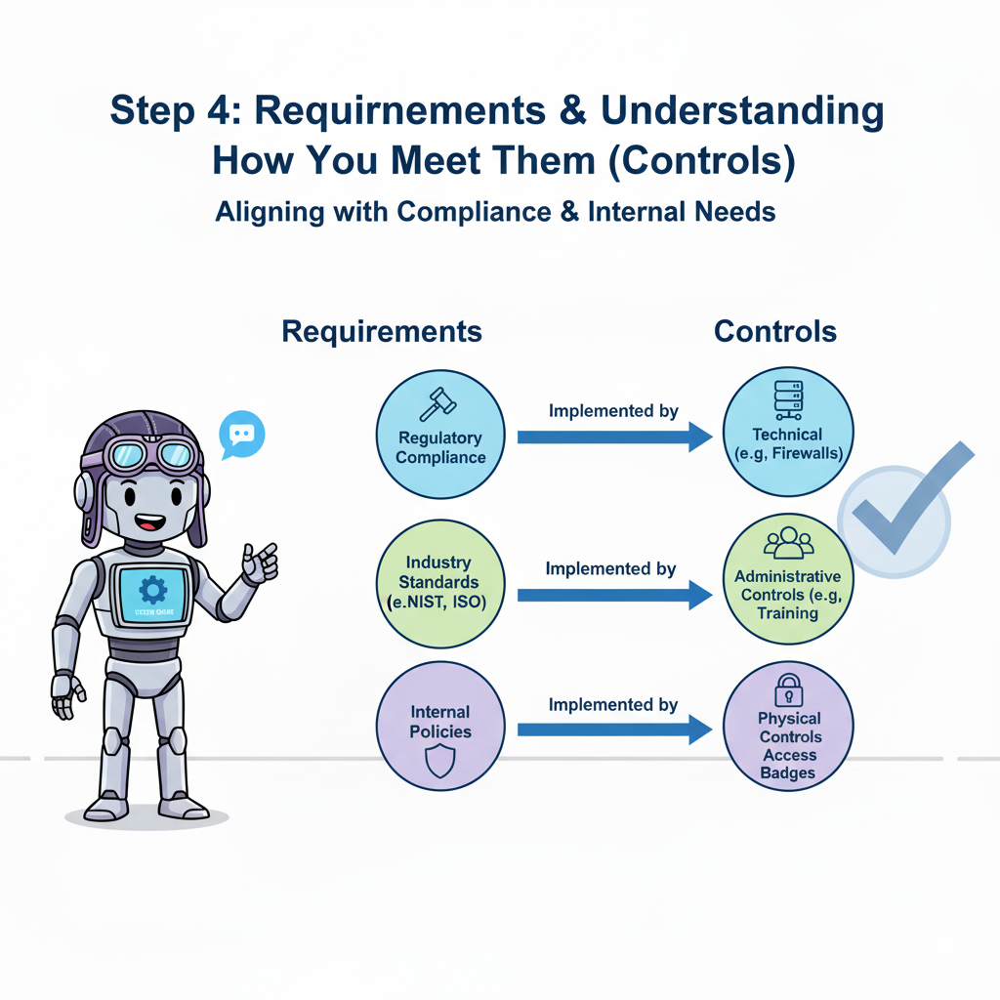

# Phase 4: Requirements & Controls
*Or: How I Learned to Stop Worrying and Love Compliance Frameworks*

## Overview: Building Your Compliance Foundation (Without Losing Your Soul)

Right, let's talk about requirements and controls - the compliance equivalent of sorting your life out, but with considerably more acronyms and significantly less immediate gratification.

Here's the thing about requirements and controls: they're like that mate who insists on reading the terms and conditions before downloading an app. Tedious? Absolutely. Necessary? Unfortunately, yes. The difference is that ignoring terms and conditions might get you targeted ads for cat food, while ignoring compliance requirements might get you a rather stern letter from a regulator who clearly doesn't appreciate your creative interpretation of data protection laws.

**Why This Phase Actually Matters (Beyond Avoiding Regulatory Wrath):**

Most organizations approach compliance like teenagers approach homework - last minute, panic-driven, and with a suspicious amount of copy-pasting from Wikipedia. They'll implement random security controls with all the strategic planning of a drunk person ordering takeaway at 3am, then act surprised when auditors ask uncomfortable questions about why they have seventeen different password policies and no actual password management.

Requirements establish *what* you must achieve to avoid becoming a cautionary tale in next year's data breach statistics, while controls define *how* you achieve it without driving your staff to therapeutic levels of wine consumption. WINGMAN's approach creates what we optimistically call "dynamic relationships" between requirements and controls - which is a fancy way of saying everything actually talks to everything else, rather like a functional family dinner conversation.

## What You'll Achieve (Realistic Edition)

### Primary Outcomes:
- **Compliance Clarity**: You'll finally understand which regulations actually apply to you, as opposed to the ones you've been frantically implementing because someone mentioned them in a LinkedIn post
- **Control Inventory**: A proper list of your security measures that doesn't include "Steve from IT checks things sometimes"
- **Gap Identification**: Precise documentation of what's missing, broken, or held together with digital duct tape
- **Evidence Framework**: Automated proof that you're doing what you claim you're doing (revolutionary, I know)
- **Dynamic Relationships**: Your security measures will actually work together instead of operating like competing political parties

### Time Investment:
- **Implementation**: 3-5 days (assuming normal levels of organizational dysfunction)
- **Ongoing Maintenance**: 2-4 hours monthly (less time than you spend arguing about which video call platform to use)

---

## Step-by-Step Implementation Guide

### Step 4.1: Requirements Framework Selection
*Or: Choosing Your Regulatory Adventure*

#### Why This Step Matters (Beyond the Obvious)

Most organizations approach compliance requirements like they're at an all-you-can-eat buffet after a particularly aggressive diet - they pile everything onto their plate without considering whether they can actually digest it all or if half of it even applies to their dietary needs.

I once worked with a small design consultancy that was desperately trying to implement HIPAA compliance. When I gently inquired why they thought they needed healthcare data protection regulations, they explained that someone at a networking event had mentioned it was "best practice." They designed websites for estate agents. The closest they came to healthcare data was the occasional client mentioning their bad back.

#### What You'll Actually Do:

**1. Identify Applicable Regulations (The "What Actually Applies to Me" Exercise)**

Think of this as compliance speed dating - you're looking for regulations that are genuinely compatible with your business model, not just the ones that sound impressive at industry conferences.

- **Geographic requirements**: If you process EU citizen data, GDPR isn't a suggestion, it's a legally enforceable relationship you've entered into whether you like it or not
- **Industry-specific mandates**: HIPAA for healthcare, PCI DSS if you handle payments, SOX if you're publicly traded and enjoy additional paperwork
- **Contractual obligations**: Customer security requirements that seemed reasonable when you were desperate for the contract

**2. Select Relevant Standards (The Framework Beauty Contest)**

Here's where organizations typically go wrong: they choose frameworks like they're collecting Pokemon cards, gotta catch 'em all. ISO 27001, NIST CSF, CIS Controls - suddenly they're implementing enough frameworks to power a small bureaucracy.

Pro tip: Pick one primary framework that actually makes sense for your organization. Yes, just one. I know this goes against every consultant's instinct to make things as complicated as possible, but trust me on this.

**3. Import Requirement Sources (The Digital Archaeology Phase)**

WINGMAN connects to major compliance databases, which is considerably more reliable than your current system of "keeping important compliance documents in Sarah's email somewhere."

#### The Implementation Process (What Actually Happens):

```markdown
Step 1: Complete WINGMAN's Compliance Reality Check
- Answer honest questions about what you actually do (not what your marketing materials claim)
- Review requirements recommendations (WINGMAN won't judge your past compliance decisions)
- Select frameworks that won't require hiring a team of full-time compliance monks

Step 2: Review the Verdict
- WINGMAN presents applicable requirements with explanations in actual English
- Priority ranking based on "what regulators actually care about" vs "what sounds good in presentations"
- Implementation complexity estimates (spoiler: it's usually more complex than you think)

Step 3: Make Adult Decisions
- Confirm requirements that make business sense
- Set realistic timelines (add 50% to whatever you initially think)
- Establish compliance targets that won't require supernatural intervention
```

### Step 4.2: Control Definition & Implementation Mapping
*Or: Finding Out What You Actually Do vs. What You Think You Do*

#### Why This Step Matters (The Uncomfortable Truth)

Here's a fun exercise: ask three different people in your organization to describe your backup procedures. You'll get three completely different answers, none of which will accurately reflect what actually happens when someone accidentally deletes the customer database at 4:47 PM on a Friday.

Most organizations have security measures scattered around like mismatched furniture in a shared flat - technically functional, but nobody's quite sure how it all fits together or who's responsible for what. Your firewall configuration was set up by someone who left the company two years ago, your access controls are managed through a combination of Active Directory and prayer, and your incident response plan exists as a beautifully formatted PDF that nobody's actually read since the compliance audit.

#### What You'll Do (The Archaeological Dig):

**1. Inventory Existing Controls (The "What Do We Actually Have" Survey)**

This is where WINGMAN becomes your digital detective, investigating your infrastructure like a particularly thorough forensic accountant. It's going to find controls you'd forgotten you had, identify things you thought were controls but aren't, and diplomatically point out that "Bob manually checks the logs when he remembers" isn't technically a monitoring control.

Example discovery from a recent client:
```markdown
Controls We Thought We Had:
- "Robust endpoint protection across all devices"
- "Comprehensive access management"
- "Regular security monitoring"

What WINGMAN Actually Found:
- Antivirus software on 60% of devices (expired licenses on the rest)
- Password spreadsheet shared via Dropbox ("for convenience")
- Security monitoring that emails alerts to an abandoned mailbox
```

**2. Map Controls to Requirements (The Great Matching Game)**

This is where things get interesting. WINGMAN will attempt to connect your actual controls to your compliance requirements, which often results in discoveries like finding out your expensive security software is protecting against threats from 2003 while completely ignoring the regulations you're supposed to be complying with this century.

**3. Define Control Effectiveness Measures (The "Prove It" Challenge)**

Here's where most organizations stumble. They can tell you they have controls, but ask them to prove those controls actually work, and you'll get the organizational equivalent of nervous laughter and subject changes.

#### Real-World Example: The Case of the Phantom Firewall

I once worked with a financial services firm that proudly listed "enterprise-grade firewall protection" as a key control. When WINGMAN investigated, it discovered:

- The firewall was indeed enterprise-grade (from 2009)
- It was protecting a network segment that hadn't been used since their office move
- Their actual internet connection was running through a consumer-grade router that someone had nicknamed "Little Trevor"
- Nobody could remember the admin password for either device

The gap analysis was... illuminating.

### Step 4.3: Compliance Gap Analysis & Treatment Planning
*Or: Facing the Music (With a Decent Soundtrack)*

#### Why This Step Matters (The Moment of Truth)

Gap analysis is like looking at your bank statement after a particularly enthusiastic weekend - uncomfortable, necessary, and likely to reveal some decisions that seemed perfectly reasonable at the time but now require adult intervention.

The difference between WINGMAN's approach and traditional gap analysis is that WINGMAN creates actionable improvement roadmaps rather than the usual consultant deliverable of "implement everything immediately and also here's a bill for £50,000."

#### What Actually Happens:

**1. Comprehensive Gap Analysis (The Audit of Reality)**

WINGMAN's analysis engine works like a particularly thorough but diplomatic friend who's helping you organize your life. It won't judge your past decisions, but it will point out that having your password policy written on a Post-it note stuck to the server might not meet regulatory expectations.

```markdown
Coverage Gaps WINGMAN Typically Finds:
- Requirements floating in space without corresponding controls
- Controls that technically exist but work about as well as a chocolate teapot
- Evidence that exists "somewhere" but can't be located when needed

Effectiveness Gaps (The "It Should Work" Category):
- Controls configured by someone who's moved to Australia
- Monitoring systems monitoring each other in an infinite loop
- Procedures that assume everyone has psychic powers
```

**2. Risk-Based Prioritization (The Triage Approach)**

Not all gaps are created equal. Some are like having mismatched socks - technically suboptimal but unlikely to cause existential crisis. Others are like driving without brakes - immediately attention-requiring.

WINGMAN ranks gaps based on:
- **Regulatory Impact**: "Will this get us in trouble with people who can issue fines?"
- **Implementation Complexity**: "Can we fix this without hiring a team of quantum physicists?"
- **Business Disruption**: "Will fixing this break everything else we're doing?"

---

## Real Examples (From the Trenches)

### Example 1: The Marketing Agency's GDPR Adventure

**The Setup:**
Small creative agency, 25 employees, European clients, more enthusiasm than cybersecurity budget. Their initial compliance approach could charitably be described as "hopeful."

**What They Thought They Had:**
- "GDPR-compliant privacy policy" (copied from a template they found online)
- "Secure client data storage" (Dropbox Business account)
- "Employee data protection training" (forwarded a blog post about GDPR)

**What WINGMAN Discovered:**
```markdown
Requirements Analysis:
✓ GDPR applies (they process EU citizen data)
✓ UK GDPR applies (post-Brexit complications)
⚠️ Client contractual requirements (enterprise clients demanding SOC 2)

Control Reality Check:
❌ Privacy policy doesn't match actual data processing
❌ Client files scattered across personal Dropbox accounts
❌ No data retention procedures
❌ Marketing automation platform collecting data nobody remembered
✓ Actually decent office physical security (buzzer entry system)
```

**WINGMAN's Treatment Plan:**
```markdown
Phase 1 (Month 1) - Stop the Bleeding:
- Audit all data collection points
- Implement proper consent management
- Centralize client data storage with proper access controls

Phase 2 (Month 2-3) - Build Proper Infrastructure:
- Document data processing procedures
- Implement data retention policies
- Train staff on actual procedures (not blog posts)

Phase 3 (Month 4) - Evidence and Monitoring:
- Set up automated compliance monitoring
- Establish breach detection procedures
- Create audit trail systems
```

### Example 2: The Manufacturing Company's Multi-Framework Nightmare

**The Situation:**
Mid-size manufacturer trying to comply with ISO 27001, NIST Cybersecurity Framework, and various customer security requirements. Previous approach: implement everything and hope for the best.

**The Existing Chaos:**
```markdown
Control Inventory Highlights:
- 17 different password policies (none consistently enforced)
- Network segmentation by "tribal knowledge"
- Incident response plan that referenced systems decommissioned in 2019
- Vulnerability management via Excel spreadsheet
- Change management process involving ceremonial email chains

Requirements Coverage:
ISO 27001: 43% covered, 31% partially covered, 26% "what's that then?"
NIST CSF: 38% identify, 22% protect, 67% detect, 15% respond, 8% recover
Customer Requirements: "Let's not talk about it"
```

**WINGMAN's Strategic Intervention:**
```markdown
Step 1 - Requirement Consolidation:
- Identified 73% overlap between frameworks
- Created unified control set addressing multiple requirements
- Eliminated duplicate controls (goodbye, 14 redundant password policies)

Step 2 - Control Rationalization:
- Mapped existing controls to unified requirements
- Identified 12 controls covering multiple compliance obligations
- Found 27 "controls" that weren't actually controlling anything

Step 3 - Evidence Revolution:
- Automated collection from existing systems
- Integrated vulnerability scanner data
- Created compliance dashboards that update automatically
```

**Result:** Went from compliance chaos to streamlined system covering all requirements with 40% fewer individual controls to manage.

---

## Common Pitfalls (The Greatest Hits of Compliance Disasters)

### 1. The Kitchen Sink Approach
**What Goes Wrong:** "We'll comply with everything! ISO 27001, NIST, CIS Controls, that framework Johnson heard about at the conference, and let's throw in some military standards just to be safe."

**Real Example:** I worked with a 30-person software company that was simultaneously implementing ISO 27001, SOC 2, NIST CSF, and PCI DSS. They needed SOC 2 for one client contract and PCI DSS because they thought they might process payments someday. They were spending more on compliance consultants than their entire engineering team.

**The Reality Check:** Pick frameworks based on actual business requirements, not consultant recommendations or conference FOMO.

### 2. Control Theater
**What Goes Wrong:** Implementing impressive-sounding controls that look great on paper but work about as well as a screen door on a submarine.

**Real Example:** A client had implemented "advanced threat detection" by configuring their firewall to email alerts to security@company.com. Plot twist: nobody had access to that email account, and it had been forwarding to a distribution list that included someone's personal Gmail account and a printer.

**The Fix:** WINGMAN focuses on controls that actually function and can be validated, not just documented.

### 3. The Set-and-Forget Syndrome
**What Goes Wrong:** Creating beautiful control documentation and then treating it like a museum piece - preserved perfectly and never actually used.

**Real Example:** Found a company with a 47-page incident response plan that was updated quarterly, professionally bound, and had never been tested. When they had their first actual security incident, they couldn't find a printed copy and the digital version was stored behind their compromised VPN.

**Prevention:** WINGMAN builds living documentation that updates automatically and can be accessed when you actually need it.

### 4. Evidence Collection Panic
**What Goes Wrong:** Implementing controls without considering how you'll prove they work, then scrambling during audit season like students before finals.

**Real Example:** A financial services client had excellent access controls but no audit trail. During their regulatory examination, they couldn't prove who had access to what or when changes were made. The examiner's report was... creative in its criticism.

**The Solution:** WINGMAN sets up evidence collection during implementation, not as an afterthought.

### 5. The Goldilocks Control Problem
**What Goes Wrong:** Controls that are either too restrictive (nobody can get any work done) or too permissive (everyone has admin access "for flexibility").

**Real Example:** A healthcare client implemented access controls so strict that doctors couldn't access patient records during emergencies, leading to controls being disabled "temporarily" during their busiest period. Six months later, they were still disabled.

**The Balance:** WINGMAN helps calibrate controls based on actual business processes, not theoretical security ideals.

---

## Pro Tips (Hard-Earned Wisdom)

### 1. Start With Your Business Reality, Not Compliance Fantasy
**The Tip:** Let WINGMAN analyze what you actually do before deciding what you should do. Most compliance failures happen when organizations implement controls that don't match their business reality.

**Why It Works:** Controls that fit your actual business processes get implemented properly and stay implemented. Controls that require everyone to work differently get bypassed faster than a traffic jam on the M25.

### 2. Use the Three-Color Honesty System
**The Approach:** Mark each requirement/control as:
- 🟢 Green: "We're actually doing this properly"
- 🟡 Yellow: "We're sort of doing this but it could be better"
- 🔴 Red: "We're definitely not doing this and pretending won't help"

**Real Benefit:** Creates honest assessment without the usual organizational tendency to grade everything as "partially compliant" (the compliance equivalent of "it's complicated" on Facebook).

### 3. Prioritize Like Your Auditor's Watching
**The Strategy:** Focus first on requirements that auditors consistently examine and where findings have real business consequences.

**Example:** GDPR data retention policies get checked in every privacy audit. Your color-coded filing system for physical documents? Not so much. Guess which one WINGMAN recommends implementing first.

### 4. Integrate Controls Into Existing Workflows
**The Insight:** The best security controls are the ones that make existing work easier, not harder.

**Success Story:** Instead of adding a separate security review step to their development process, one client integrated security checks into their existing code review workflow. Adoption went from "grudging compliance" to "actively requested feature."

### 5. Automate Evidence Before You Need It
**The Wisdom:** Set up automated evidence collection when you implement controls, not when the auditors book their site visit.

**Time Savings:** One client reduced audit preparation from six weeks of frantic document gathering to two days of report generation. Their staff productivity during audit season improved dramatically (as did their collective blood pressure).

---

## WINGMAN Capabilities Unlocked

After completing Phase 4, WINGMAN transforms from a helpful assistant into something resembling a competent compliance manager who doesn't take sick days:

### Compliance Command Center
- **Real-time compliance dashboard**: No more "I think we're compliant" conversations
- **Control effectiveness monitoring**: Identifies failing controls before auditors do
- **Evidence status tracking**: Know what you can prove and what you can't
- **Gap remediation progress**: Visual proof that you're actually fixing things

### Intelligent Requirements Engine
- **Automatic regulatory updates**: No more missed regulatory changes because someone forgot to check the government website
- **Cross-framework mapping**: Understands that ISO 27001 A.12.1.2 and NIST CSF PR.IP-1 are basically the same thing
- **Duplicate requirement elimination**: Stops you from implementing the same control seventeen different ways

### Dynamic Control Assessment
- **Continuous monitoring**: Like having a security analyst who never sleeps and doesn't drink your coffee
- **Automated evidence validation**: Checks that your controls are actually doing what you think they're doing
- **Performance benchmarking**: Compares your security posture to similar organizations (anonymously, we're not monsters)

### Audit Readiness (The Good Kind)
- **One-click compliance reports**: Generate audit packages without archaeological expeditions through file servers
- **Evidence correlation**: Automatically links controls to requirements to evidence
- **Gap analysis with remediation timelines**: Shows auditors you have a plan, not just problems

---

## Validation Checklist (The "Are We Actually Done?" Assessment)

Before declaring victory and moving to Phase 5, ensure you've actually completed:

### Requirements Framework ✓
- [ ] Regulations identified based on actual business needs (not compliance FOMO)
- [ ] Standards selected with adult supervision
- [ ] Requirements imported without breaking anything
- [ ] Scope defined clearly enough that future you will understand it
- [ ] Stakeholders consulted and haven't fled the building

### Control Inventory ✓
- [ ] Controls discovered and documented honestly
- [ ] Control-requirement relationships established (and they make sense)
- [ ] Effectiveness assessed based on reality, not optimism
- [ ] Evidence collection configured and tested
- [ ] Gap analysis completed without causing organizational trauma

### Implementation Reality ✓
- [ ] Priority gaps identified and ranked logically
- [ ] Timeline established (with buffer time for real life)
- [ ] Resource requirements estimated (including caffeine budget)
- [ ] Success metrics defined measurably
- [ ] Plans documented comprehensibly

### System Functionality ✓
- [ ] WINGMAN dashboards configured and displaying actual data
- [ ] Evidence collection working automatically
- [ ] Monitoring established and alerting appropriately
- [ ] Reports generating without manual intervention
- [ ] Integrations tested and stable

---

## Next Steps (The Path Forward)

### Immediate Post-Implementation Actions
1. **Validate Everything Works**: Test your new compliance framework like you're actually going to rely on it (because you are)
2. **Communicate Success**: Share progress with stakeholders using small words and colorful charts
3. **Begin Evidence Collection**: Start gathering proof that you're doing what you claim you're doing

### Preparing for Phase 5: Risk Management
Your shiny new requirements and controls framework becomes the foundation for Phase 5, where WINGMAN will help you identify what could go wrong and what you'll do about it. Think of it as preparing for Murphy's Law with actual planning instead of just hoping for the best.

**What Phase 5 Will Build On:**
- Risk identification based on your actual control inventory
- Threat mapping to specific requirements (because different threats matter for different compliance obligations)
- Risk treatment prioritization based on compliance impact
- Integration between risk management and your new control framework

### Ongoing Maintenance (The Care and Feeding of Your Compliance System)
- **Monthly**: Review dashboards, check evidence collection, fix anything that's broken
- **Quarterly**: Update requirements for regulatory changes, assess control effectiveness
- **Annually**: Complete review and refresh (because things change and so do you)

The transformation from "we think we're secure" to "we can prove we're compliant" is now complete. Phase 5 will add the final layer: understanding what could go wrong and having a plan that doesn't involve panic and wishful thinking.

Congratulations - you now have a compliance framework that might actually survive contact with reality.