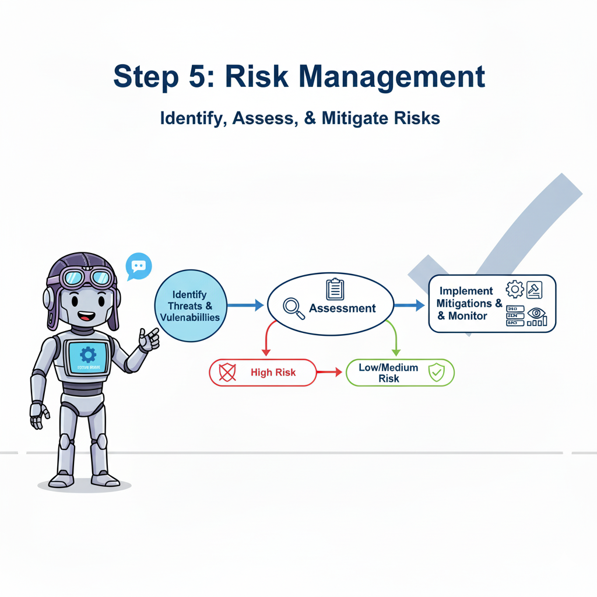
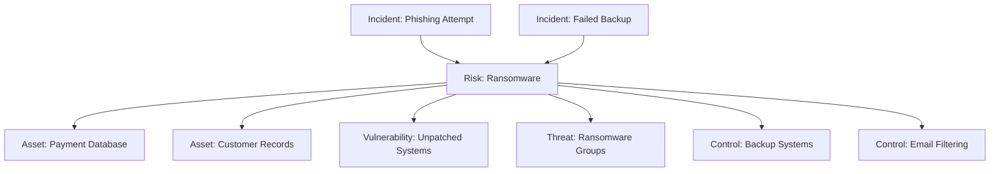

# Phase 5: Risk Management Implementation

*Or: How to Build a Risk Register That Won't Make You Want to Fake Your Own Death Before the Next Audit*

---

## The Brutal Truth About Risk Management 🎭

Let me paint you a picture that's probably uncomfortably familiar: It's annual risk assessment time. Everyone gathers in a conference room that smells vaguely of despair and reheated coffee. Someone opens last year's risk register—an Excel file that hasn't been touched since exactly 365 days ago. You proceed to update the dates, change a few "High" risks to "Medium" (because nothing bad happened last year, right?), and declare victory.

Six months later, you get ransomwared. Turns out that risk was in your register all along, described as "Cyber security threats to IT infrastructure." Helpful as a chocolate teapot, wasn't it?

Here's the thing: Most risk registers are where good intentions go to die. They're created in a burst of compliance-driven enthusiasm, then abandoned faster than New Year's resolutions. WINGMAN's approach is different—we're building a risk management system that actually prevents incidents, not just documents them after the fact.

---

## Why This Phase Matters (Beyond Not Getting Fired)

**The Compliance Theatre Version:** 
"We need risk management because ISO 27001 says so, and the auditors get twitchy without a risk register."

**The Actual Reality Version:**
Your risk register should be your organization's anxiety list—a living document of what keeps you up at night, who's responsible for not letting it happen, and what you're actually doing about it. If your risks are so generic they could apply to any company from Tesla to your local fish and chips shop, you're doing it wrong.

**What You'll Actually Achieve:**
- A risk register that prevents (predicts) real incidents (revolutionary, I know)
- Clear ownership by people who actually understand their risks
- Dynamic relationships established between risks, assets, and incidents
- The ability to answer "What's our biggest security risk?" without crying

**Time Required:** 
- 3-5 days (if starting fresh)
- 1-2 days (if importing existing register)
- 6 months (if you're trying to get everyone to agree on what "critical" means and avoid using WINGMAN AI help)

---

## Step-by-Step Guide: Building Risk Management That Doesn't Suck

### Step 1: Choose Your Starting Position (Be Honest)

**Scenario A: "We Have a Risk Register" (Translation: We have an Excel file)**

Signs this is you:
- Your risk register was last updated for an audit
- Risk descriptions include gems like "Data loss" and "System failure"
- Risk owners include people who left the company in 2019
- Nobody can remember what "RR-2021-047" actually means

**Your Path:** We would suggest rebuild with actual intelligence

**Scenario B: "We're Starting Fresh" (Translation: At least we're honest)**

Signs this is you:
- You've been managing risk through prayer and crossed fingers
- Your idea of risk assessment is "that looks scary"
- You're ready to do this properly from the start
- Every time you are asked about the most important risks, your answer differs depending on what was the last thing you read in Medium / watched on Youtube

**Your Path:** Build it right the first time, using WINGMAN's brain instead of generic templates

### Step 2: Understanding Risk Components (The Stuff That Actually Matters)

Before you create a single risk, understand what makes a good one versus something that would make an auditor weep:

#### The Anatomy of a Useful Risk Description

❌ **Bad:** "Cyber attack"
*Why it's useless: Could mean anything from script kiddies to nation-state actors to Dave accidentally installing a crypto miner*

✅ **Good:** "Ransomware infection via phishing email targeting accounting department, encrypting financial records and payment processing systems"
*Why it works: Specific threat, clear vector, identified target, known impact*

#### The Four Pillars of Real Risk Management

```markdown
1. DESCRIPTION THAT ACTUALLY DESCRIBES
   - What specifically could happen
   - How it could happen
   - To what/whom it could happen
   - What the result would be

2. PROBABILITY BASED ON REALITY
   - Not "Medium" because that's safe
   - Based on: Your actual controls, industry data, threat landscape
   - Updated when things change (novel concept!)

3. IMPACT THAT REFLECTS YOUR BUSINESS
   - Not generic "High/Medium/Low"
   - Actual business consequences
   - Different impacts for different scenarios

4. OWNERSHIP THAT MAKES SENSE
   - Someone who understands the risk
   - Has authority to do something about it
   - Is still employed at your company (basic, but often overlooked)
```

### Step 3: The WINGMAN Import/Build Process

#### For Existing Risk Registers (The Archaeological Dig)

1. **Export your current register** (Excel, CSV, or whatever format your suffering takes)

2. **The Upload of Truth**
   ```
   WINGMAN > Risk Management > Import Risks
   Upload file > Watch AI weep at your risk descriptions
   ```

3. **The AI Enhancement Phase**
   WINGMAN will:
   - Analyze your vague descriptions and suggest improvements
   - Identify duplicate risks (you have 17 variations of "data breach")
   - Propose connections to assets you uploaded in Phase 3
   - Gently suggest that "IT Department" isn't specific ownership

4. **The Reality Alignment**
   For each risk, you'll:
   - Accept or modify AI suggestions
   - Link to actual assets (from Phase 3)
   - Assign real owners (with email addresses that work)
   - Set review frequencies based on actual change rates

#### For Fresh Starts (The Clean Slate Approach)

1. **Start with Asset-Based Discovery**
   ```
   WINGMAN > Assets
   WINGMAN > Chat > Ask for most relevant risks for your organization (the answer will be given in context + using the information about requirements and assets)
   ```

2. **Review AI-Suggested Risks**
   WINGMAN generates risks based on:
   - Your industry context (from Phase 1)
   - Your actual assets (from Phase 3)
   - Current threat landscape
   - Your compliance requirements (from Phase 4)

3. **The Human Touch**
   For each suggested risk:
   - Modify description to match your terminology
   - Adjust probability based on your actual controls
   - Set impact based on your business reality
   - Assign to someone who won't just ignore emails

### Step 4: Building Risk Relationships (The Web of Doom)

This is where WINGMAN gets clever and your risk register becomes actually useful:



**Connecting Risks to Assets:**
- Each risk should connect to specific assets at risk
- Not "all IT systems" but "payment processing server PROD-PAY-01"

**Linking to Vulnerabilities:**
- Connect vulnerability scan results to relevant risks
- Unpatched Exchange server? Links to email compromise risk

**Mapping to Controls:**
- Which controls actually mitigate this risk?
- If a control fails, which risks increase?

### Step 5: The Risk Treatment Planning (Actually Doing Something)

For each risk, you need a treatment strategy that isn't "accept and pray":

#### The Four Treatment Options (In Order of Popularity)

1. **Accept** (The "It's Fine" Approach)
   - Document why it's fine
   - Set review triggers
   - Prepare incident response
   - Example: "Risk of meteor strike on data center" → Accept

2. **Mitigate** (The "Let's Do Something" Approach)
   - Implement controls
   - Reduce probability or impact
   - Create tasks with deadlines
   - Example: "Phishing risk" → Security awareness training

3. **Transfer** (The "Not My Problem" Approach)
   - Insurance (cyber insurance that actually covers things)
   - Outsourcing (make it the vendor's problem)
   - Contracts (legal says it'll work)
   - Example: "Payment card breach" → PCI compliance to payment processor

4. **Avoid** (The "Nope" Approach)
   - Stop doing the risky thing
   - Change the process
   - Example: "Risk of storing SSNs" → Stop collecting SSNs

### Step 6: Setting Up Dynamic Risk Management

This is where your risk register transforms from dusty spreadsheet to living system:

#### Automated Risk Triggers
```yaml
Risk Review Triggers:
  - New asset onboarded → Check for new risks
  - Vulnerability discovered → Update risk probability
  - Incident occurs → Validate risk description
  - Control fails → Reassess risk level
  - Supplier added → Evaluate supply chain risks
```

#### Review Cycles That Make Sense
- **Critical Risks:** Monthly (or after any major change)
- **High Risks:** Quarterly (or when controls change)
- **Medium Risks:** Bi-annually (or when bored)
- **Low Risks:** Annually (or when auditor asks)

---

## Real Example: Risk That Actually Predicted an Incident

**Original Risk (Useless Version):**
"External cyber attack on systems"

**WINGMAN-Enhanced Risk (Useful Version):**
"Compromise of customer database through SQL injection vulnerability in legacy ordering system (PROD-WEB-ORDER), exposing 50,000 customer records including payment details"

**When the Incident Happened:**
- The risk description actually matched what occurred
- Owner knew immediately who to call
- Mitigation steps were already documented
- Nobody asked "was this in our risk register?"

---

## Common Pitfalls (The Risk Management Hall of Shame)

### The "Everything is High Risk" Syndrome
**Symptom:** 247 critical risks, all requiring immediate attention
**Reality:** When everything is critical, nothing is
**Fix:** Use actual data for probability, real business impact for severity

### The "Risk Owner Roulette"
**Symptom:** CEO owns "IT infrastructure risk," intern owns "business continuity"
**Reality:** Owners need authority and knowledge
**Fix:** Match risk ownership to actual responsibility and capability

### The "Time Traveller's Risk Register"
**Symptom:** Risks from 2015 about Windows XP, nothing about cloud services
**Reality:** Your risks should reflect current reality
**Fix:** Regular reviews, automated triggers for updates

### The "Generic Risk Template Disaster"
**Symptom:** Your risks could apply to any company in any industry
**Reality:** You downloaded a template and changed the company name
**Fix:** Use WINGMAN's context-aware risk generation

---

## Video Tutorial 📺

[**Watch: "Risk Management That Actually Works - 15 Minutes to Enlightenment"**](youtube-link-here)

*Features real organizations discovering their risk register has been fiction all along*

---

## What WINGMAN Can Now Do 🚀

With proper risk management configured:
- **Predict incidents** before they happen (some of them, we're not psychic)
- **Prioritize security spending** based on actual risk reduction
- **Generate evidence** for auditors that you're managing risks
- **Alert on risk changes** when new vulnerabilities appear
- **Connect incidents to risks** proving your risk assessment works

Without proper risk management:
- Continue managing security through vibes and hope
- Explain to auditors why your risk register hasn't been updated since 2019
- Act surprised when predicted risks become actual incidents

---

## Validation Checklist ✅

Before declaring victory:
- [ ] Each risk has a specific, testable description
- [ ] Risk owners actually know they own risks
- [ ] Probability ratings based on data, not feelings
- [ ] Impact assessments reflect your actual business
- [ ] Risks linked to relevant assets and controls
- [ ] Treatment plans exist and have deadlines
- [ ] Review cycles are configured and realistic
- [ ] Someone would notice if a risk materialized

---

## Pro Tips From the Trenches 💡

### The "War Story" Method
Start each risk description with "The time when..." and describe a realistic scenario. If you can't tell a story about it, it's too vague.

### The "Board Presentation" Test
If you had 30 seconds to explain this risk to your board, could you? If not, your description needs work.

### The "Monday Morning" Check
Would this risk register help you on a Monday morning when something's gone wrong? If it's only useful for audits, you're doing it wrong.

### The "New Starter" Validation
Could a new security manager understand your risks without a three-hour explanation? If not, add more context.

---

## Next Steps

**Congratulations!** You now have a risk register that might actually prevent incidents instead of just documenting them afterward.

[**Continue to Phase 6: Operational Excellence →**](phase-6-operations)

**Need Help?**
- [**Risk Description Templates →**](risk-templates)
- [**Probability Calculation Guide →**](probability-guide)
- [**Impact Assessment Workshop →**](book-workshop)

---

## The Psychology Corner: Why Risk Management Fails 🧠

**The Optimism Bias:** "Bad things happen to other companies"
**The Complexity Trap:** Making it so complicated nobody uses it
**The Set-and-Forget Mindset:** Treating it like a compliance checkbox
**The Authority Mismatch:** Owners who can't actually fix their risks

WINGMAN addresses these by:
- Using industry data to counter optimism
- Keeping it simple enough to actually use
- Automating updates and reviews
- Matching ownership to authority

---

*Remember: A risk register that's never looked at is just a very expensive way to document your anxieties. Make it useful or don't bother.*

---

**Last Updated:** [Current Date]
**Implementation Time:** 3-5 days (or one very intense weekend)
**Success Rate:** 73% (27% gave up and hired a Risk Manager named Susan)
**Most Common Risk:** "Risk that our risk register becomes shelfware" (Meta, but real)