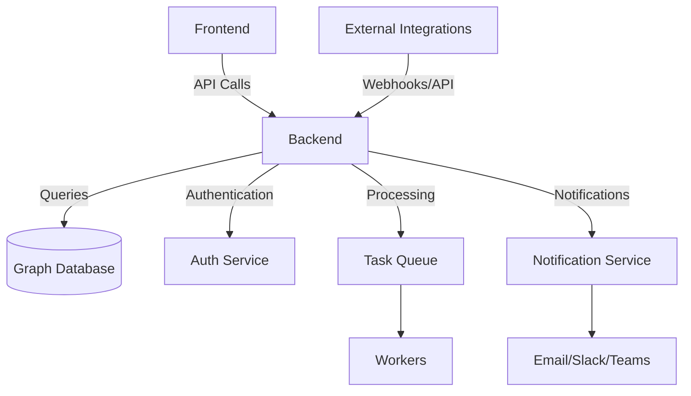

# WINGMAN Overview

## Core Philosophy

WINGMAN is built on three foundational principles that guide its design and functionality:

### 1. People, Process, Technology Balance

WINGMAN recognizes that effective security requires the right combination of people, processes, and technology:

- **People**: Empowers security teams with the right information and tools
- **Process**: Embeds security into organizational workflows
- **Technology**: Leverages modern technologies like graph databases and AI

### 2. Live Security Context Concept

WINGMAN maintains a real-time, interconnected view of your security posture:

- **Real-time Data**: Always up-to-date security information
- **Contextual Relationships**: Understands how different security elements relate
- **Actionable Insights**: Provides clear guidance based on current context
- **Visual Mapping**: Interactive visualizations of your security landscape

### 3. Human-in-the-Loop Approach

WINGMAN enhances human decision-making rather than replacing it:

- **AI-Assisted**: Provides recommendations and automation
- **Human Oversight**: Critical decisions remain with security professionals
- **Continuous Learning**: Improves based on user feedback and actions
- **Expertise Amplification**: Makes security expertise more effective

## Architecture Overview

WINGMAN's architecture is designed for flexibility, scalability, and security:

### Key Components

1. **Frontend**
   - Modern, responsive web interface
   - Simple and intuitive user experience
   
2. **Backend**
   - RESTful APIs to allow easy integration
   - Authentication and authorization

3. **Database**
   - Neo4j graph database hosted in the cloud
   - Optimized for complex relationship queries

4. **Task Queue**
   - Celery for asynchronous tasks
   - Scheduled jobs and background processing
   - Horizontal scaling

5. **Integration Layer**
   - API Gateway
   - Pre-built connectors for common tools

## Key Features

### 1. Graph-Powered Security Context

- Visual relationship mapping
- Impact analysis
- Dependency tracking
- Context-aware recommendations

### 2. Comprehensive Node Management

- Multiple node types (assets, controls, risks, etc.)
- Custom attributes and relationships
- Versioning and history
- Bulk operations

### 3. Workflow Automation

- Customizable workflows
- Approval processes
- Notifications and escalations
- Audit trails

### 4. Reporting and Analytics

- Custom report builder
- Scheduled reports
- Executive dashboards
- Compliance reporting

### 5. Integration Capabilities

- REST API
- Pre-built connectors
- Custom integration framework

## Use Cases

### 1. Security Posture Management

- Continuous monitoring of security controls
- Real-time risk assessment
- Control effectiveness analysis

### 2. Compliance Management

- Automated evidence collection
- Control mapping to frameworks
- Audit preparation and support

### 3. Risk Management

- Risk identification and assessment
- Treatment planning and tracking
- Risk aggregation and reporting

### 4. Incident Response

- Incident tracking
- Response coordination
- Post-incident analysis

## Next Steps

- [Explore Core Concepts](../core-concepts/graph-database.md)
- [Learn about Node Types](../core-concepts/node-types.md)
- [Set Up Your First Integration](../integrations/overview.md)
