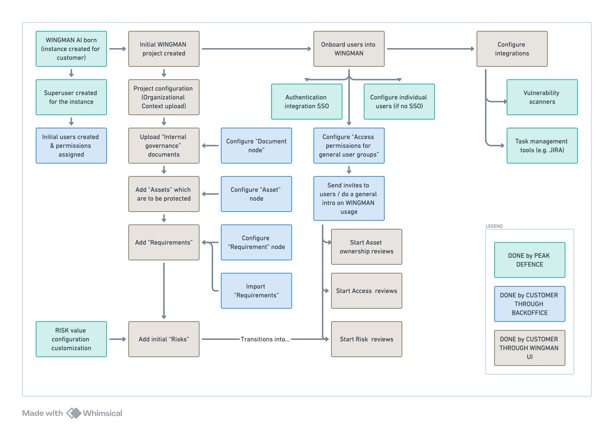

# Quick Start Guide

This guide will help you get started with WINGMAN quickly. Follow these steps to set up and start using WINGMAN in your environment.

General process follows this pattern:

## Prerequisites

To use WINGMAN as a user you only need:
- A modern web browser (Chrome, Firefox, Safari, or Edge)
- Required ports open in your firewall to be able to access WINGMAN
- WINGMAN account created for your organization
- Optionally if you want to use WINGMAN with the MCP connection, you would need your preferred LLM chat platform to support MCP connection to WINGMAN server and MCP enabled for your WINGMAN account

To be able to administer backofice of WINGMAN you need:
- Account for your company WINGMAN back off administration
- A computer with Docker installed which allows deployment of WINGMAN backoffice Docker

More details about administrator access to WINGMAN backoffice can be found under [Setting Up WINGMAN](../setup/setup-overview.md).

### Browser Requirements

- Google Chrome (latest 2 versions)
- Mozilla Firefox (latest 2 versions)
- Apple Safari (latest 2 versions)
- Microsoft Edge (latest 2 versions)

### Authentication methods

One should choose the authentication method to be used for WINGMAN. Our currently supported authentication methods are:
- WINGMAN built in authentication
- SSO (Single Sign-On) authentication with Google 
- SSO (Single Sign-On) authentication with Azure AD
- Custom SSO options with OpenID Connect

More information on [Authentication](../integrations/authentication.md)

## Installation of WINGMAN backoffice

### 1. Download WINGMAN backoffice docker

(TBD)
Download the latest WINGMAN package from our [downloads page](https://wingman.peakdefence.com/downloads).

1. Check the [Troubleshooting](#troubleshooting) section above
2. Contact our [Support Team](mailto:support@peakdefence.com)
