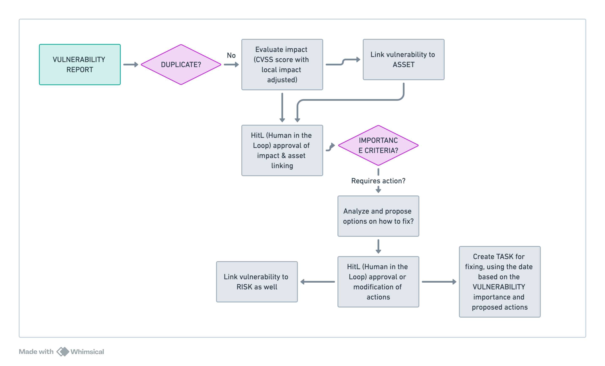

# Pen-Testing Tools Integration

## Overview

The Pen-Testing Tools integration enables WINGMAN to retrieve vulnerabilities identified in network, web, and other security scans performed by pentest-tools.com scanners. This integration ensures that discovered vulnerabilities automatically initiate appropriate WINGMAN flows and are properly linked to relevant assets within your organization's security context.

## Integration Type

This is a **Node Integration** where vulnerability data from pentest-tools.com becomes part of WINGMAN's **Vulnerability Reports** node type. The integration maintains two-way communication to ensure consistent updates and information retrieval between pentest-tools.com and your WINGMAN instance.



## Data Collection Method

The integration collects data through pentest-tools.com webhook interface, which is triggered automatically after each scan completion. This ensures real-time vulnerability data import without manual intervention.

## Integration Architecture

### Webhook Reception Process

1. **Scan Completion**: pentest-tools.com completes security scan
2. **Webhook Trigger**: Vulnerability data is sent to WINGMAN webhook endpoint
3. **Data Processing**: WINGMAN processes incoming vulnerability information
4. **Flow Initiation**: Appropriate vulnerability handling flows are triggered

### Standard WINGMAN Flow Principles

The integration follows WINGMAN's core flow concepts:

#### De-duplication
- Automatically checks if similar vulnerabilities already exist in the system
- Prompts users when potential duplicates are identified
- Prevents redundant vulnerability entries

#### Data Enrichment
- Ensures minimum required data quality for vulnerability reports
- Enriches vulnerability data with organizational context
- Links to relevant threat intelligence and remediation guidance

#### Relationship Updates
- Automatically establishes connections between new vulnerabilities and existing nodes
- Updates affected relationships when vulnerabilities are modified or resolved

## Node Relationships

The integration automatically creates and maintains relationships between:

| Source Node | Target Node | Relationship Type | Description |
|-------------|-------------|-------------------|-------------|
| Vulnerability Reports | Assets | affects/protects | Links vulnerabilities to affected systems and applications |
| Vulnerability Reports | Risks | realizes/mitigates | Associates vulnerabilities with existing risk scenarios |
| Vulnerability Reports | Tasks | remediates | Creates or links to remediation action items |
| Vulnerability Reports | Security Controls | validates/requires | Connects to existing or required security controls |
| Vulnerability Reports | Requirements | fulfills/violates | Links to relevant compliance or security requirements |

## AI-Powered Contextual Analysis

WINGMAN's AI capabilities enhance the integration by providing:

### Asset Context Awareness
- Analyzes vulnerabilities against your specific asset inventory
- Determines relevance to your actual environment
- Identifies affected systems and their criticality levels

### Intelligent Prioritization
- Suggests priority scores based on asset criticality and exposure
- Considers organizational risk appetite and compliance requirements
- Factors in existing security controls and compensating measures

### Automated Action Proposals
- Generates remediation tasks with appropriate urgency levels
- Suggests assignment to relevant team members
- Proposes timelines based on severity and organizational policies

## Example Workflow

### New Vulnerability Detection Flow

When pentest-tools.com identifies a new vulnerability:

1. **Contextual Assessment**
   ```
   "I've identified a CVE-2024-XXXX vulnerability in Apache Tomcat 9.0.65. 
   I know we're using Tomcat in production systems: 
   - Web Application Server A (v9.0.65) - AFFECTED
   - Development Environment B (v9.0.70) - NOT AFFECTED
   - Legacy System C (v8.5.82) - DIFFERENT VERSION
   
   Impact: HIGH - Production system affected with public-facing exposure"
   ```

2. **Impact Analysis**
   - Links to related risk scenarios (e.g., "Web Application Compromise")
   - Identifies affected assets and their business criticality
   - Reviews existing security controls and their effectiveness

3. **Action Generation**
   - Creates tasks in integrated task management system (e.g., Jira)
   - Assigns appropriate priority and urgency
   - Suggests remediation steps and timelines
   - Links to relevant security requirements or compliance obligations

## Benefits

### Live Security Context Maintenance
- Real-time updates to organizational security posture
- Automatic relationship mapping between vulnerabilities and infrastructure
- Historical tracking of vulnerability trends and remediation effectiveness

### Enhanced Decision Making
- AI presents findings with suggested actions and context
- Security officers can approve, modify, or add additional context
- Maintains comprehensive audit trail of decisions and rationale

### Tool Integration Enhancement
- Works alongside existing vulnerability management platforms
- Enhances rather than replaces current security operations
- Provides unified view across all security tools and processes

## Configuration

### Superuser Configuration Options

The integration is configured through WINGMAN's backoffice application with the following options:

#### Asset Mapping
- Map pentest-tools.com asset categories to your organizational asset taxonomy
- Define asset criticality mappings
- Configure automatic asset discovery and registration

#### Vulnerability Scoring
- Align pentest-tools.com severity ratings with organizational risk appetite
- Configure custom scoring algorithms
- Set up severity-based escalation rules

#### Task Automation
- Define automated task creation rules
- Configure assignment logic based on vulnerability characteristics
- Set up notification and escalation paths

#### Integration Settings
- Configure webhook authentication and security settings
- Set up data synchronization schedules
- Define retention policies for vulnerability data

## Security Considerations

### Webhook Security
- Implement proper authentication mechanisms
- Use HTTPS for all webhook communications
- Validate incoming data integrity and authenticity

### Data Privacy
- Ensure vulnerability data is processed according to organizational policies
- Implement appropriate access controls and data retention policies
- Maintain audit logs for all integration activities

## Supported pentest-tools.com Scan Types

The integration supports vulnerability data from all pentest-tools.com scanner types:

- **Network Security Scans**: Infrastructure vulnerability assessments
- **Web Application Scans**: OWASP Top 10 and custom vulnerability checks
- **SSL/TLS Configuration Tests**: Certificate and encryption analysis
- **Email Security Tests**: Mail server and configuration assessments
- **DNS Security Scans**: Domain and DNS infrastructure analysis

## Implementation Requirements

### Prerequisites
- Active pentest-tools.com subscription with webhook access
- WINGMAN instance with appropriate integration permissions
- Configured asset inventory within WINGMAN
- Defined vulnerability handling procedures and task assignment rules

### Setup Process
1. Configure webhook endpoint in pentest-tools.com account
2. Set up integration credentials in WINGMAN backoffice
3. Map asset taxonomies between systems
4. Configure vulnerability scoring and prioritization rules
5. Define automated task creation and assignment logic
6. Test integration with sample vulnerability data
7. Train security team on new workflow processes

This integration exemplifies WINGMAN's core promise of making existing security investments more effective and efficient by providing the contextual intelligence needed for better prioritization and informed decision-making.