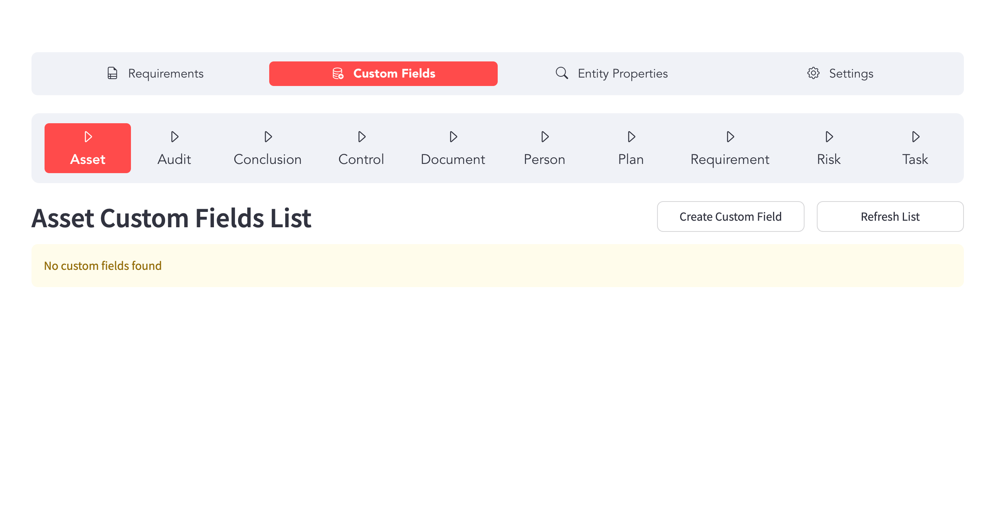
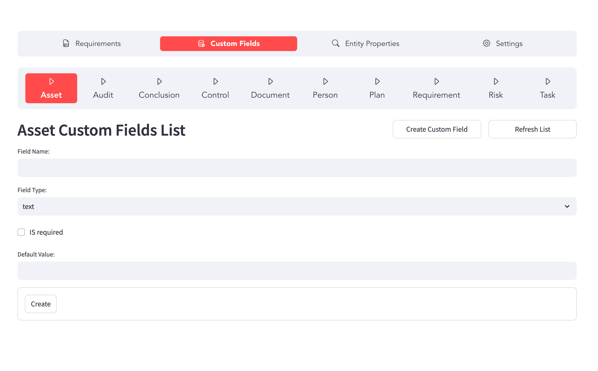
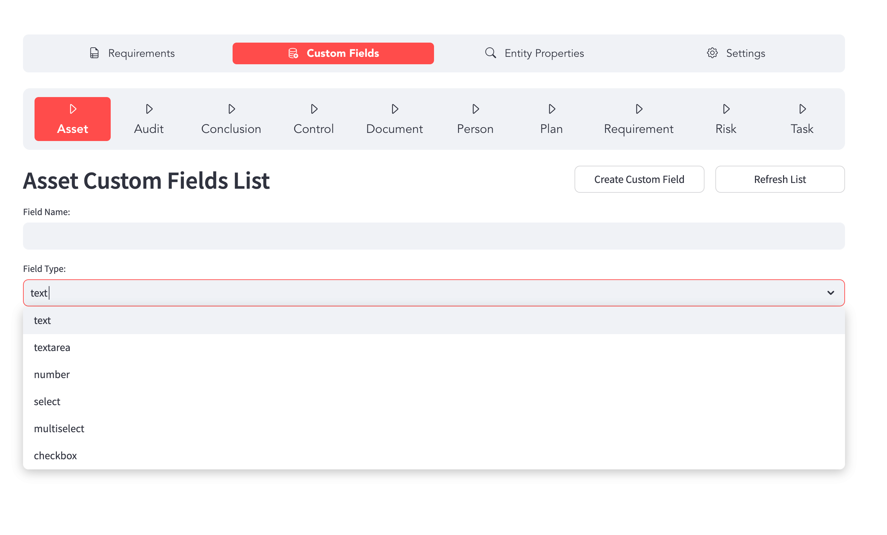

# Node Configuration

This guide explains how to configure nodes in WINGMAN. The configuration is done via WINGMAN backoffice.

## Overview

Nodes in WINGMAN represent entities in your security environment. This guide covers how to configure different parameters for Nodes.

## Custom field configuration
Custom fields can be configured for each Node. The custom fields can be of different types. The addition is done 

Following types of custom fields can be added

| Field type | Description |
| --- | --- |
| Text | Single line text field |
| Textarea | Multi line text field |
| Select | Dropdown field with ability to select one item |
| Multiselect | Dropdown field with ability to select more than one item |
| Number | Number field |
| Checkbox | Checkbox field |

## Properties

Each node has some default properties contents of which can be modified (think of those as options to be able to select from for specific property in dropdown).

The default properties available as per node type  are:

| Node type | Owner | Status | Type | Source | Priority | Maturity | Role | 
| --- | --- | --- | --- | --- | --- | --- | --- | 
| Assets | Y | Y | Y | N | N | N | N |
| Controls | Y | Y | Y | N | N | N | N |
| Documents | Y | Y | Y | Y | N | N | N |
| People | Y | Y | Y | N | N | N | N |
| Requirements | Y | Y | Y | N | N | N | N |
| Risks | Y | Y | Y | N | N | N | N |
| Tasks | Y | Y | Y | N | N | N | N |
| Plans | Y | Y | Y | N | N | N | N |
| Vulnerabilities | Y | Y | Y | N | N | N | N |
| Threats | Y | Y | Y | N | N | N | N |
| Incidents | Y | Y | Y | N | N | N | N |
| Conclusions | Y | Y | Y | N | N | N | N |

## Configuration Process

1. Navigate to **Settings** > **Node Configuration**
2. Select the node type
3. Configure the node properties
4. Save the configuration

## Best Practices

- Use consistent naming conventions
- Document all custom node types
- Regularly review and update node configurations
