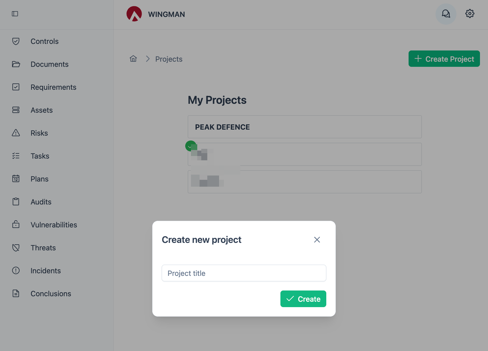
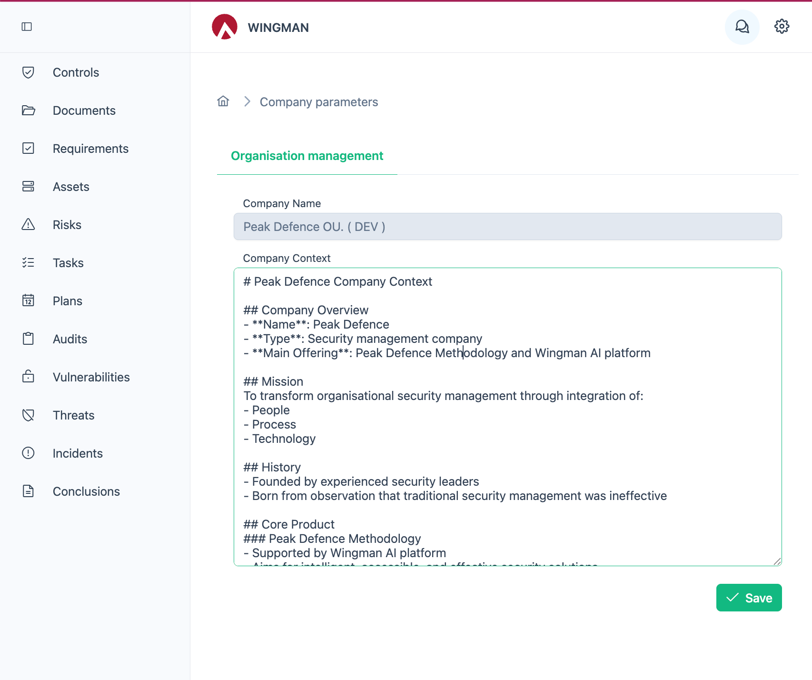

# Setting Up WINGMAN

This part of the guide focuses on how an organizational admin would set up your WINGMAN instance before users start to use it!

## Creating project(s)
Projects are used to allow work on multiple different types of nodes (assets, people, etc.) in a single context within organization. Some examples of projects could be:

> - ISMS project (working on information security context) 
> - Management level risks for whole company (risks and assets company management recognizes as important not necessarily just in security context)
> - AI risks (separate project to deal with AI risks and AI specific assets)

To create new project in WINGMAN, the user has to have the relevant permissions. 

## Setting project (organizational context)

We suggest you set up the organizational context once and only update it as needed. The context will be used by WINGMAN to extract main information about your organization. While we have a WINGMAN agent to help you build the context, meanwhile you can also use the structure as provided in the [company-context](./company-context.md) example here. 

The company context can be entered by clicking on the settings "gear" icon in the top right corner of the screen and then selecting "Company Parameters". This field supports using of Markdown as it is read by AI tools during usage of Chat or Flows functionality.

## Recommended deployment sequence

### Uploading policy & procedure documents

Document handling normally is done in following steps:
1. Agreeing on document structure and document types
2. Configuring document structure and document types in the backoffice
3. Uploading documents to WINGMAN

#### Document structure configuration

Based on our experience we suggest using following or similar document type classification, but you can feel free to use something different:
- Internal governance -> Policy, procedure, instruction, guideline type of documents (internal documents governing WHAT is allowed, WHAT is disallowed and how to do things)
- Contracts and other types of "requirements" driven documents 
- Regulatory documents (e.g. GDPR, NIS 2, DORA, etc)

Following additional metadata types have shown to be relevant for the documents

##### Internal governance

For these following additional field configurations are recommended

| Field name | Description | Type |
| --- | --- | --- |
| Document type | Type of document with values: Policy, Procedure, Guidance | Dropdown |
| Document status | Status of document with values: Draft, Approved, Rejected | Dropdown |
| Document approval status | Approval status of document with values: Approved, Rejected | Dropdown |
| Document approval date | Approval date of document | Date |
| Document approval by | Approval by of document | User selector |

##### Contracts

For these following additional field configurations are recommended

| Field name | Description | Type |
| --- | --- | --- |
| Document type | Type of document with values: Customer contract, Vendor contract, etc | Dropdown |
| Document status | Status of document with values: Draft, Signed, Rejected | Dropdown |
| Document sign date | Approval date of document | Date |
| Document end validity date | End validity date of document | Date |

##### Regulatory

For these following additional field configurations are recommended

| Field name | Description | Type |
| --- | --- | --- |
| Document type | Type of document with values: Regulation, Applicable Standard, Legislation | Dropdown |
| Geography of applicability | Geography of applicability of document (custom to your organization, e.g. EU, US, etc) | Dropdown |
| Document status | Status of document with values: Draft, Approved, Rejected, Outdated | Dropdown |
| Document approval date | Approval date of document | Date |

#### Uploading documents to WINGMAN

Uploading documents is done through direct access to documentation nodes. 
[Document upload and management](../usage/nodes-documents.md)

**Related use cases**

[Policy & procedure management](../use-cases/policy-procedure-management.md)

### Registering assets

Registering of assets normally should be done in following steps:

1. Agreeing on asset structure
2. Configuring asset structure in the backoffice
3. Registering assets in WINGMAN and creating relevant initialrelationships 

**Related use cases**

[Asset management](../use-cases/asset-registry.md)

### Uploading relevant requirements

We at Peak Defence have already created a set of requirements based on the most common standards and regulations. As those are region specific, additional requirements might be imported or manually entered by user.

Uploading requirement sets is done through WINGMAN Backoffice.

Individual requirements can be modified or created throught [Requirements management](../usage/nodes-requirements.md)

