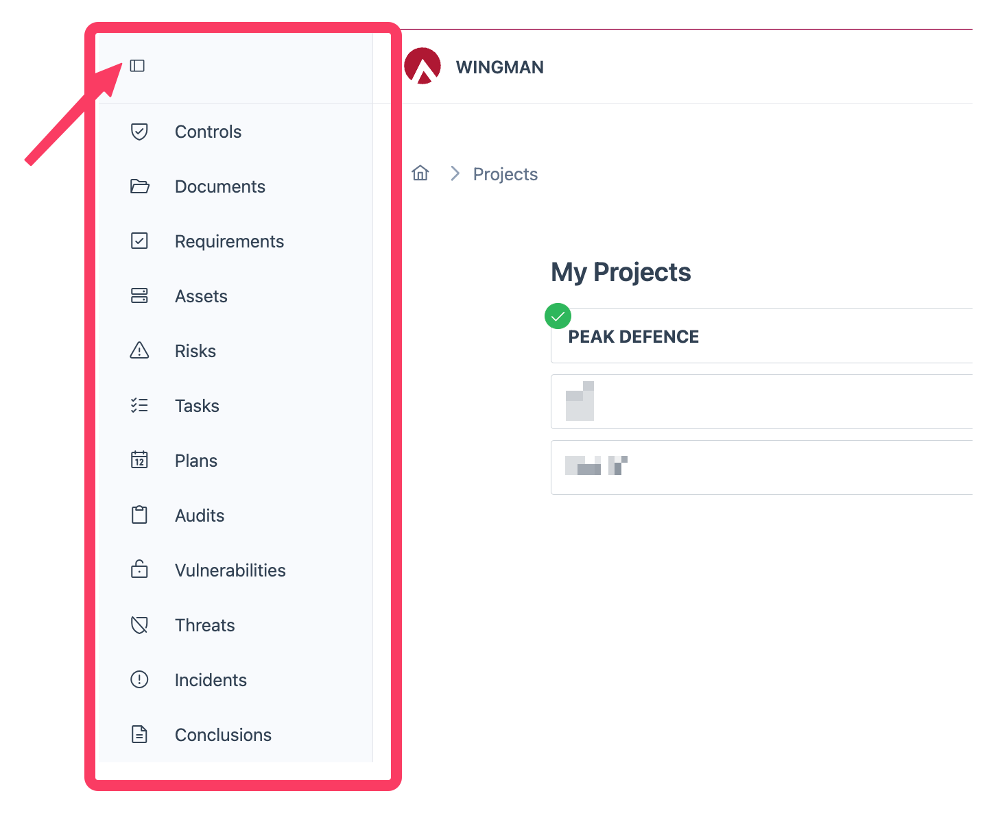

# WINGMAN User Interface Guide

This guide provides an overview of the WINGMAN web interface and its key features to help you navigate and utilize the platform effectively.

## Authentication window

Once navigating to the page representing WINGMAN working for you, you will be asked to authenticate. This is done by entering your username and password or selecting one of SSO options available. More details on this topic can be found in the [Authentication](../integrations/authentication.md) section.

## Navigation

### Project selector

Once you start working with WINGMAN you might see or not see project selector. This depends on the amount of projects configured in your deployment.

In this window you would select the project you want to work with. If you have only one project configured, you will not see this window and the default project will be selected by default.

### Navigation bar

On the left side of the screen you will see navigation bar. This bar contains a list of *Nodes* available to you. The navigation bar can be collapsed to save space by clicking the menu icon in the top left corner.

The nodes available to you are:

- **Controls**: Manage controls applicable to your organization
- **Documents**: Manage documentation relevant for your organization's security
- **Requirements**: Manage regulatory and internal security requirements
- **Assets**: Manage and view all assets
- **Risks**: Manage and view all risks
- **Tasks**: Manage and view all tasks
- **Plans**: Manage and view all plans related to security (e.g. risk treatment plan, audit finding fix plan, etc)
- **Vulnerabilities**: View and manage security findings
- **Threats**: Manage and deal with Threat reports
- **Incidents**: Manage and deal with Incident reports
- **Evidence**: Manage and view all evidence related to security findings and audits
- **Conclusions**: Manage audit findings and corresponding transition of findings into conclusions

### Settings view

This menu allows you to configure organization settings

Under settings following options are available to the user:

1. Project selection
2. Updating context for the selected project (if permissions to do so are granted)
3. Viewing Privacy Policy and Terms of Service for WINGMAN
4. View and update user's settings on email notifications and display language
5. Logout / terminate session

### Chat window
User can open a chat window in WINGMAN using the menu on the top right corner of the screen:

Once chat window is opened user can either:
1. Initiate a new conversation
2. Continue a previous conversation maintaining the context of the conversation

**Initiating a new conversation**

**Continuing a previous conversation**

## Next Steps

- [Integration Overview](../integrations/overview.md)
